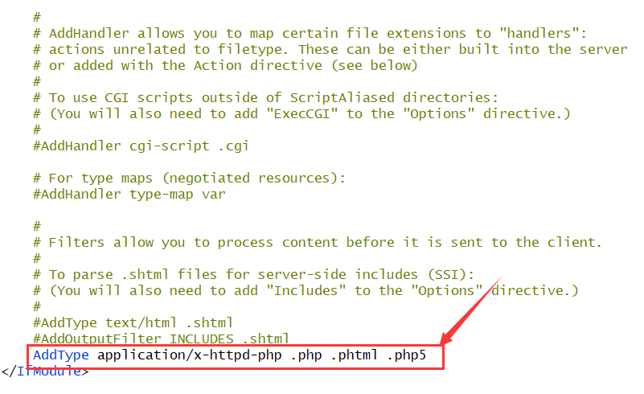
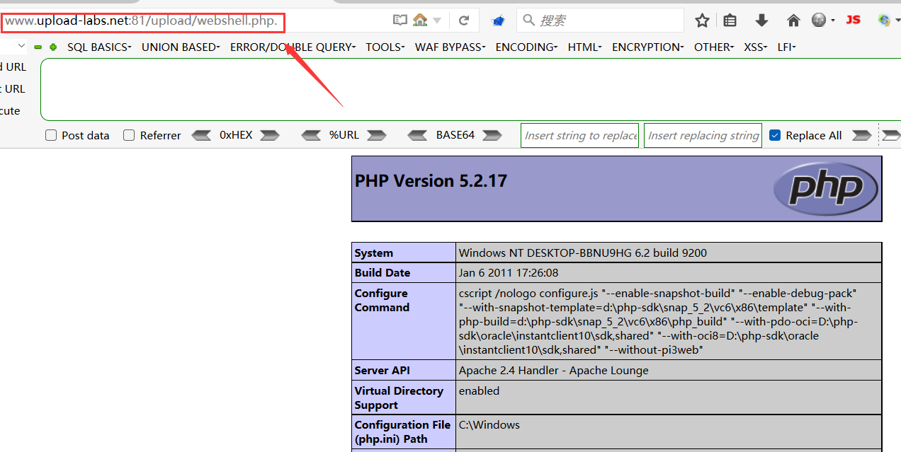
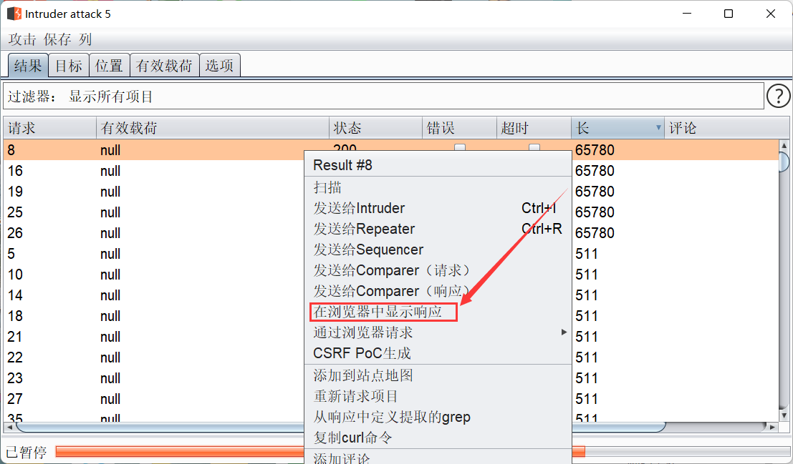
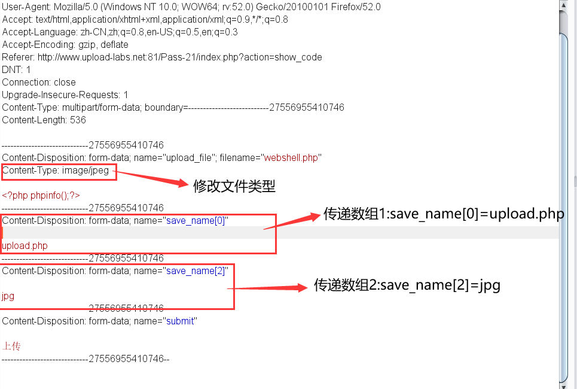

# 靶场简介

upload-labs是一个专门用于学习文件上传漏洞攻击和防御的靶场。它提供了一系列模拟文件上传漏洞的实验环境，用于帮助用户了解文件上传漏洞的原理和防御技术。

这个靶场包括了常见的文件上传漏洞类型，如文件名欺骗、文件类型欺骗、文件上传功能绕过等。通过练习不同的攻击方式，用户可以加深对文件上传漏洞的理解和提高对这类漏洞的攻击和防御技能

	

<br>

# 靶场搭建

upload-labs靶场下载地址：https://github.com/c0ny1/upload-labs

将下载好的upload-labs解压至phpstudy的WWW目录，随后开启phpstudy

	

<br>

# 靶场通关

## pass-1(JS代码绕过)

### 源码审计

查看网页HTML源码, 可以发现此关卡是通过JS代码来验证上传文件的类型, 只要将JS代码禁止掉就能绕过上传限制

	

<br>

### 演示步骤

准备一个webshell.php脚本文件, 文件内容如下所示, 是一个简单的一句话木马

```
<?php @eval($_POST[123]);?>
```

<br>

将脚本文件上传, 结果直接被网站拦截掉了

	

<br>

网页栏输入`about:config`, 搜索javascript, 将`javascript.enabled的`值设置为`false`, 即表示浏览器禁止执行javascript代码

	

<br>

刷新第一关卡页面, 再次上传webshell.php, 鼠标右键查看该图像的地址, 即为webshell的网页路径. 例如此处我上传的webshell路径为http://www.upload-labs.net:81/upload/webshell.php

	

<br>

打开蚁剑, 输入webshell的路径和密码, 然后点击测试连接, 显示连接成功

	

<br>

## pass-2(MIME类型绕过)

### 源码审计

此关卡是通过对上传的文件类型进行检验, 若文件类型不为`image/jpeg`, 则上传失败, 只需抓包修改Content-type字段的值为`image/jpeg`即可绕过限制


<br>

### 演示步骤

使用burpsuite抓取上传webshell.php的数据包, 将Content-Type字段的值修改成`image/jpeg`

		

<br>

文件上传成功, 后面操作就不演示了

	

<br>

## pass-3(上传可解析后缀)

### 源码审计

此关卡的黑名单只有asp、aspx、php、jsp, 并没有限制php3, php5这些后缀

	

<br>

### 演示步骤

首先, 我们需要在phpstudy的http.conf文件添加如下一行, 目的是为了让网站能够解析后缀为php5文件, 然后重启phpstudy

```
AddType application/x-httpd-php .php .phtml .php5
```

		

<br>

上传webshell.php5文件, 文件内容如下所示:

```
<?php phpinfo();?>
```

<br>

文件上传成功后, 鼠标右键复制下面的图片路径, 该路径即为上传的webshell, 可以发现网站是能够解析php5文件的


<br>

## pass-4(上传.htaccess)

### 源码审计

点击右上角的提示, 发现这关卡限制上传的文件后缀还是挺多的, 例如第三关的php3, php5这些后缀都被禁止掉了, 但是还是有漏网之鱼的, 就是`.htaccess`文件

`.htaccess`文件是apache服务器中的一个配置文件，它负责相关目录下的网页配置。通过htaccess文件, 可以实现网页301重定向、自定义404页面、改变文件扩展名、允许/阻止特定的用户访问目录等等。

要注意的是, 当php版本高于5.2.17时，`.htaccess`文件上传漏洞就不再存在, 所以说这个漏洞在实战环境下几乎时不肯能存在的


<br>

### 演示步骤

上传`.htaccess`文件, 文件内容如下:

```
<FilesMatch "webshell">
Sethandler application/x-httpd-php 
</FilesMatch>
```

> .htaccess会改变uploads这个目录下的文件解析规则, 调用php的解析器去解析一个文件名只需包含`“webshell”`字符串的任意文件
>
> 简单来说, 若一个文件的文件名为`webshell.jpg`, 其内容是`phpinfo()`, 那么apache就会调用php解析器去解析此文件	

<br>

随后上传webshell.jpg, 文件内容如下:

```
<?php phpinfo();?>
```

<br>

上传成功后查看文件路径, 可以发现网站使用php解析了webshell.jpg里的内容, 执行了`phpinfo()`代码

		

<br>

## pass-5(后缀添加`. .`)

### 源码审计


首先看下`$file_name = deldot($filename)`这行代码, 它的作用是将上传文件最末尾的"."去除掉了, 我们可以利用它这个机制来绕过后缀限制, 例如上传一个文件名为`webshell.php. .`, 经过deldot函数的处理后文件名为`webshell.php.`

然后再看下`strrchr`函数, 该函数的作用是返回的字符串从指定字符的位置开始，包含指定字符。因此，`$file_ext`变量中保存的是文件的扩展名, 也就是说最终`$file_ext`的值为`.`

`$deny_ext`是一个存有黑名单后缀的数组, 后面代码判断`$file_ext`是否是黑名单后缀, 由于`$file_ext`的值为`.`, 并不属于限制后缀, 因此能够上传成功

<br>

### 演示步骤

如下图所示, burpsuite抓取上传文件的数据包, 将文件名称修改成`webshell.php. .`, 随后文件上传成功

		

<br>

查看上传的文件, 虽然文件后缀有个`.`, 但是依旧不影响网站对其的解析

	

<br>

## pass-6(后缀大小写)

### 源码审计

审计源码可以发现, 此关卡去除了大小写转换函数, 也就是说可以通过构造大小后缀来绕过限制, 例如Php,PHP这种后缀


<br>

### 演示步骤

上传webshell.php并抓包, 修改文件名为`webshell.Php`

		

<br>

上传成功后访问脚本文件, 如下图所示


<br>

## pass-7(空格绕过)	

### 源码审计

审计源码可以发现, 此关卡去除了删除末尾空格的函数, 这样我们可以在文件后缀末尾添加空格来实现绕过


<br>

### 演示步骤

抓取上传文件的数据包, 修改文件名称, 在文件后缀末尾后面添加空格, 如下图所示

		

<br>

上传文件成功后访问脚本文件


<br>

## pass-8(后缀添加`.`)

### 源码审计

通过审计源码可知, 此关卡去除了删除文件名称最末尾的字符'.'的函数, 因此可以通过在文件后缀添加"."来绕过


<br>

### 演示步骤

抓包修改文件名为`webshell.php.`

		

<br>

文件上传成功后访问脚本文件, 虽然文件名为`webshell.php.`, 但是网站依旧能够解析

<br>	

## pass-9(`::$data`绕过)

### 源码审计

通过审计源码可以发现, 此关卡去除了删除字符串"`::$data`"的函数, 这样我们可以在文件后缀末尾添加字符串"`::$data`", 这样网站后端识别的后缀名即为`.php::$data`, 不在黑名单当中, 可以上传成功

其次, 根据Windows系统的特性, 在目录创建文件时会忽略文件名称的`::$data`进行创建, 也就是说, 最后创建的文件后缀依然是php


<br>

### 演示步骤

上传文件并抓包, 在文件后缀末尾添加字符串`::$data`

	

<br>

打开上传文件所在目录进行查看, 可以发现文件后缀经过windows系统过滤后, 变成了php后缀


<br>

访问上传的脚本文件

	

<br>

## pass-10(后缀添加`. .`)

### 源码审计

此关卡的黑名单后缀基本完善了, 就连`.htaccess`后缀也被禁掉了, 只能用老办法了, 在文件后缀末尾添加`. .`


<br>

### 演示步骤

抓包修改文件名称为`webshell.php. .`

		

<br>

上传文件后访问脚本文件


<br>

## pass-11(双写后缀绕过)

### 源码审计

此关卡用到了`str_ireplace()`函数, 作用是将文件名称中的黑名单后缀替换成空格, 并且此函数的特性是忽略大小写, 所以无法使用之前的大小写后缀进行绕过, 但是可以双重写后缀来绕过, 比如构造一个后缀为pphphp, 此函数是从前往后寻找可替换的字符串, 因此经过替换后的后缀变成了php


<br>

### 演示步骤

抓包修改文件后缀为`pphphp`

		

<br>

上传文件成功后访问脚本文件


<br>

## pass-12(%00截断绕过)	

### 源码审计

下图所示为此关卡的源码, 后面我会挑几行关键的代码来解释


<br>

```php
$file_ext = substr($_FILES['upload_file']['name'],strrpos($_FILES['upload_file']['name'],".")+1);
```

这条代码的作用是获取文件的扩展名。简单来说就是获取文件名称最后一个"."后面的字符串当作文件后缀

<br>

```php
$img_path = $_GET['save_path']."/".rand(10, 99).date("YmdHis").".".$file_ext;
```

通过GET请求来获取`save_path`参数的值, 也就是说这个值是可控的, 若我们将这个值修改成`../upload/webshell.php%00`, 也就是在文件名后面添加截断符号`%00` ,这样做的作用是将截断数据, Windows创建文件时会忽略后面 `/rand(10, 99).date("YmdHis").".".$file_ext`这行代码, 这样$img_path变量值就变成了`../upload/webshell.php`

> `%00` 是 URL 编码中的一个字符，它表示一个空字符（NULL 字符）

<br>

```php
move_uploaded_file($temp_file,$img_path)
```

将文件的名称修改成`webshell.jpg`, 通过这行代码可以将webshell.jpg移动至upload目录, 并将文件名修改成`webshell.php`

<br>

`%00`截断法只适用于php版本低于5.3的, 且需要在phpstudy把魔术引号函数magic_quotes_gpc关闭掉, 关闭方法如下图所示

	

<br>

### 步骤演示

上传webshell.php文件, 抓包修改文件名称为`webshell.jpg`, 修改save-path参数为`../upload/webshell.php%00`

	

<br>

文件上传成功后查看脚本文件, 将后面的无效内容去除掉, 即可访问成功


<br>

## pass-13(%00截断绕过)

### 源码审计

此关卡与pass-12相似， 但不同的是pass-12的save_path参数是通过get请求获取的, 而这关是通过post请求获取的, get请求传递的参数后端会自动进行解码, 但是post请求传递的参数后端不会自动解码, 因此我们要对截断符`%00`进行url解码


<br>

### 步骤演示

抓包修改post请求数据为`../upload/webshell.php%00`, 并对`%00`进行url解码		


<br>

下图是`%00`解码后的结果, 是一个肉眼看不到的空字符, 随后还需将文件名修改成`webshell.jpg`


<br>

上传文件后访问脚本


<br>

## pass-14(图片马)

### 源码审计

此关卡通过获取上传文件的内容的前两个字节来判断该文件的类型, 简单来说就通过识别文件头来判断文件类型, 我们只需修改文件头为图片格式的, 例如gif文件头:GIF89A, 就能实现绕过			

	

<br>

### 步骤演示

在文件内容前面添加字符串"GIF89A"(这是gif格式的文件头), 并将文件后缀修改成jpg

	

<br>

当然你也可以使用windows的copy命令来合并文件, 首先找一个图片文件1.jpg, 然后将其与webshell.php合并成webshell.jpg

```apl
copy 1.jpg + webshell.php webshell.jpg
```

	

<br>

随后上传文件配合文件包含漏洞解析脚本


<br>

## pass-15(图片马之getimagesize函数)

### 源码审计

这关和上一关很相似, 只不过这关是使用 `getimagesize()` 函数获取图像的信息。`getimagesize()` 函数返回一个数组，数组的第三个元素是图像的类型, 而该函数会通过读取文件头部的几个字符串(即文件头), 来判断是否为正常图片的头部, 我们只需将头部内容修改成图片文件的头部, 例如添加文件头GIF89A, 就可以绕过此机制

随后使用 `image_type_to_extension()` 函数将图像的类型转换为扩展名

	

<br>

### 步骤演示

和上一关的操作没啥区别, 在文件内容前面添加GIF89A, 并保存为jpg格式文件

	

<br>

随后上传文件配合文件包含漏洞


<br>

## pass -16(图片马之exif_imagetype函数)	

### 源码审计

根据提示, 此关卡需要开启php_exif模块, 需要修改php.ini配置文件去开启它, 如下图所示

	

<br>

此关卡使用`exif_imagetype()`函数来识别文件类型, 此函数和`getimagesize()`的原理差不多, 都是通过读取文件头来判断文件类型

	

<br>

### 步骤演示	

操作步骤和上一关一样, 这里就不演示了

<br>

## pass-17(图片马之二次渲染)

### 源码审计

此关卡使用`imagecreateformjpeg()`函数来对上传的图片文件进行二次渲染，随后返回一个新的图像文件, 由于新的图像文件是经过二次渲染后的, 所以我们在图像中布置的恶意代码也会被刷新, 从而导致不能配合文件包含漏洞来解析脚本文件

但是, 二次渲染后的文件并不是所有文件内容都会被刷新, 有一小部分是没有修改的, 我们只需找到这一小部分内容的位置, 然后将代码插入进去, 就能实现绕过

	

<br>

### 步骤演示	

首先我们上传一个包含`phpinfo()`代码的gif图片, 图片虽然成功上传, 但是却无法配合文件包含漏洞进行解析, 如下图所示, 页面显示了一堆乱码, 这显然不是我们想要的结果


<br>

我们将上传前和上传后的gif文件放到winhex工具中进行对比,其中webshell.gif是上传前的, 1400.gif是上传后的

很明显可以看出, 文件末尾的phpinfo代码经过二次渲染后, 已经不见了, 被刷掉了


<br>

但是二次渲染还是可以绕过的, 只要找到没有被它渲染过的地方, 例如, 如下图所示的这个地方来写入我们的代码, 可能你会有疑问, 为什么不在前面那段空白写入代码, 这是因为前面的内容属于文件头, 如果写入了代码就相当于破坏了文件头, 这样就不能上传文件了


<br>

既然找到地方了, 那么就往此处写代码喽, 首先复制文件末尾的phpinfo代码的十六进制数值


<br>

然后往找到的地方写入代码, 来覆盖原先的代码(注意:不是粘贴, 粘贴是插入代码)	

	

		

<br>

上传winhex修改后的文件, 配合文件包含漏洞解析gif图片的内容				

	

<br>

## pass-18(条件竞争)

### 源码审计

此关卡主要考察条件竞争, 如下代码所示, 后端先将文件上传至网站目录, 然后才对文件进行检验来决定是否删除这个文件, 如果我们在上传文件的瞬间, 也就是文件没被删除的时候, 访问这个文件, 就能实现绕过


<br>	

### 步骤演示

首先上传一个webshell.php并抓包, 将包发送给intruder模块


<br>

在intrude的负载选项设置成如下图所示, 设置完后点击右上角的开始攻击

		

<br>

然后再抓取访问上传文件的数据包并发送给intruder, 负载选项的设置和上述一致, 点击开始攻击


<br>

然后查看访问上传文件数据包的爆破结果, 找响应长度大的, 对其鼠标右键, 在浏览器中显示响应



<br>

随后复制此链接至开启了burpsuite代理的浏览器中打开


<br>

## pass-19(.7z后缀绕过)		

### 源码审计

首先创建了一个Myupload类, 并调用了此类的upload函数, 传递`UPLOAD_PATH`作为upload函数的参数, `UPLOAD_PATH`的值是上传文件的所在目录, 也就是`/upload`


<br>

转到`upload`函数的定义处, 这里要重点注意`setDir`这个函数, 此函数用于设置文件上传的目录

	

​		

转到`setDir`函数的定义处, 此处有一行代码写错了, cls_upload_dir的值应该纠正为`$dir.'/'`, 至于为何要这样纠正, 后面我会讲述

	

	

<br>

继续将代码往下翻, 此处调用了move函数


<br>

转到move函数定义处可以发现, 要是没有纠正上述代码, 那么cls_upload_dir的值就为`upload`, 此变量与`$cls_filenam`e拼接在一起后构成的文件名如下图2所示, 上传的文件就不会放在upload目录下, 而是放在网站根目录下


	

<br>			

如下代码规定了白名单后缀, 这里要特别注意7z这个后缀, 这后缀浏览器是无法解析的, 当浏览器遇到无法解析的后缀时, 就会往前解析, 要是我们上传文件名为`webshell.php.7z`, 那么浏览器就会解析`.php`后缀而不会解析`.7z`后缀


<br>

从下述代码可以看出, 此关卡和上一关差不多一个性质, 都是上传了文件后才对文件进行检验


<br>			

### 步骤演示

此关卡的操作步骤上一关差不多, 不同的是这关需要将文件名修改成`webshell.php.7z`, 详细操作这里就不再演示


<br>

## pass-20(%00截断绕过)

### 源码审计

从白名单后缀可以看出, 并没有严格限制大小写, 只要将后缀名修改成PHP就可以绕过, 或者使用截断符`%00`绕过, 文件名是通过POST请求的save_name参数来获取的


<br>

### 步骤演示

上传webshell.php文件, 将save_name参数值的文件后缀修改成PHP


<br>

使用上述方法上传文件成功后访问脚本文件

	

<br>

或者使用%00截断符号


<br>

## pass-21(数组绕过)

### 源码审计

首先判断上传的文件类型是否属于: `image/jpeg`, `image/png`, `image/gif`


<br>

然后检测上传的文件名称是否为数组, 若不为数组, 则使用explode函数将文件名按照“.”进行分割, 并将结果转换为小写, 这个 `$file` 会是一个数组, 数组的第一项是文件名，第二项是文件扩展名

也就是说如果我们上传的文件名称若为数组, 那么他就不会执行这行代码, 而是继续往下执行代码


<br>

例如此处我传递了两个数组元素, 分别是`save_name[0]=upload.php`和`save_name[2]=jpg`

`end($file)` 获取到的就是这个数组的最后一个元素，也就是文件扩展名, 然后对这个扩展名进行检验, 由于我们构造数组的最后一个元素为白名单后缀jpg, 因此能够上传文件

使用 `reset()` 函数获取数组的第一个元素,即`upload.php` , `$file[count-1]`的值为空(下面的代码很好解释了此值为何为空), 最终`$file_name`的值为`upload.php`


```php
<?php
header("Content-Type:text/html;charset=utf-8");
$save_name[0]="upload.php";
$save_name[2]="jpg";
print_r(count($save_name)); //输出数组的个数:2

print_r($save_name[count($save_name)-1]); //输出$save_name[1]的值:空

?>
```

<br>

### 步骤演示	

首先上传一个webshell.php文件, 抓包修改数据如下图所示

> 注意: 在传递数组元素值时都会多留一条空行, 不要将这条空行删除, 否则文件会上传失败



<br>

访问脚本文件


​		
