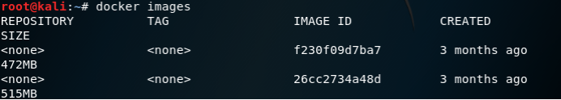

# Docker搭建

## Kail系统

### 安装

**删除原系统的docker**

```
apt-get purge docker.io
```


**添加docker的apt源码**

```
apt-get update
```

```
apt-get install -y apt-transport-https ca-certificates curl software-properties-common
```

```
curl -fsSL https://download.daocloud.io/docker/linux/ubuntu/gpg | sudo apt-key add -
```


**更新apt数据库**

```
apt-get update
```

```
apt-cache policy docker-ce*
```

```
apt-get install docker-ce
```


**配置docker镜像加速**

```
curl -sSL https://get.daocloud.io/daotools/set_mirror.sh | sh -s http://d1c9c786.m.daocloud.io
```

```
systemctl restart docker
```


### 配置

**启动docker和查看docker状态**

```
service docker start
```

```
service docker status
```


**将docker镜像复制到kali机上并导入镜像**

```
docker load < dcn_web_test.tar
```

```
docker load < dcn_upload.tar
```


**查看docker镜像ID**

```
docker images
```

	


**启动docker**

```
docker run -itd -p 8888:80 26cc2734a48d
```

